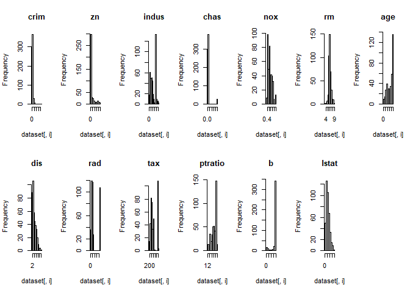
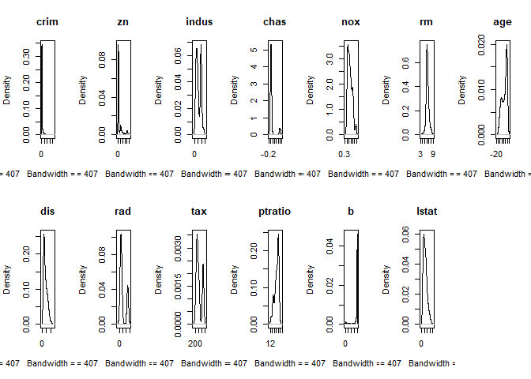
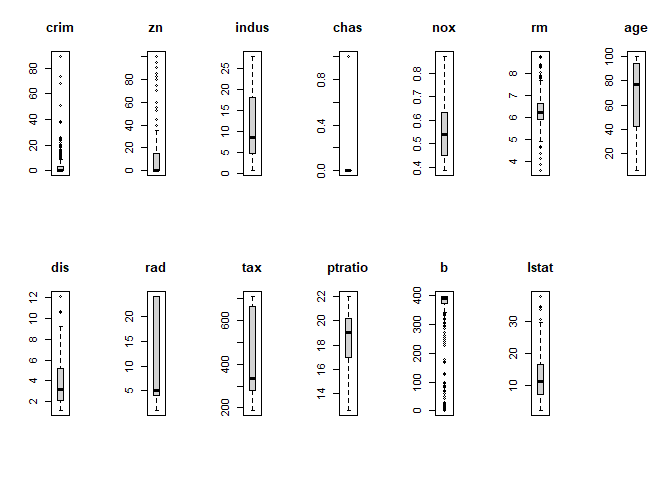
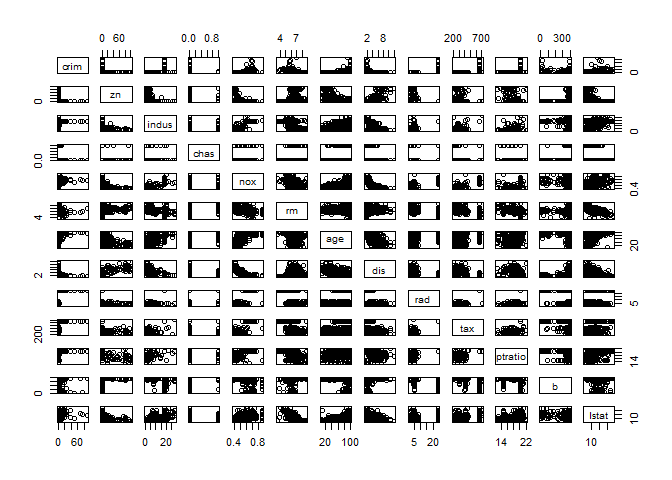
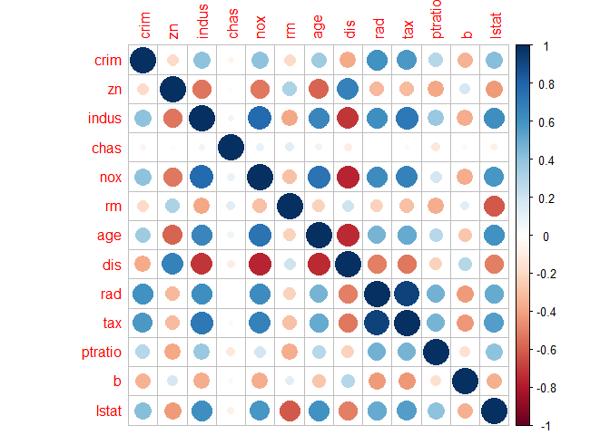
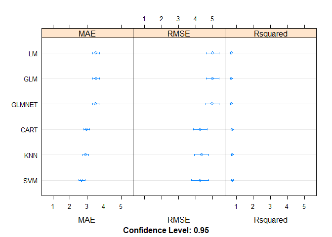
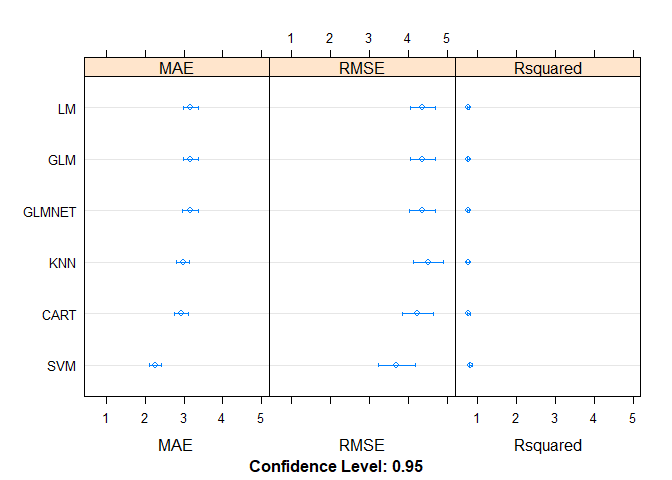
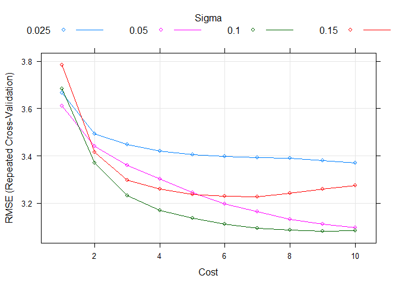
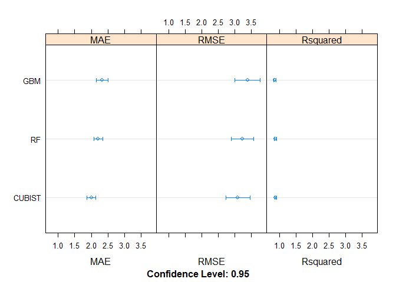
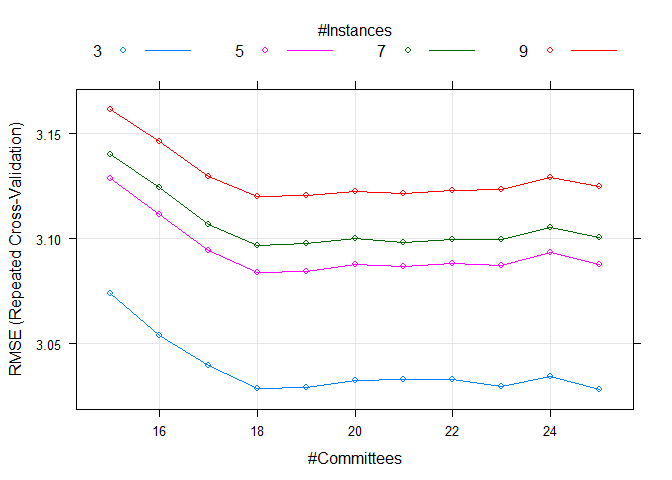

## Background
#### We have been asked to investigate the Boston House Price dataset. Each record in the database describes a Boston suburb or town. 

## Objective
#### Answer the question, can a model be built to predict house prices in Boston Area with 80% level of certainty?

## Data Description
#### The data was drawn from the Boston Standard Metropolitan Statistical Area (SMSA) in 1970. 

## Load libraries

```r
library(mlbench)
library(caret)
library(corrplot)
library(dplyr)
library(Cubist)
library(kableExtra)
library(printr)
```


## Import data

```r
data("BostonHousing")
```


## Split data into training and validation datasets

```r
# create list of 80% of rows for training
set.seed(7)
validationIndex <- createDataPartition(BostonHousing$medv, p=0.80, list = FALSE)
# select 20% of validation
validation <- BostonHousing[-validationIndex,]
# use remaining 80% of data to training and testing the models
dataset <- BostonHousing[validationIndex,]
```


## Evaluate data


```r
# check structure
str(dataset)
```

```
## 'data.frame':	407 obs. of  14 variables:
##  $ crim   : num  0.00632 0.02731 0.02729 0.03237 0.06905 ...
##  $ zn     : num  18 0 0 0 0 0 12.5 12.5 12.5 12.5 ...
##  $ indus  : num  2.31 7.07 7.07 2.18 2.18 2.18 7.87 7.87 7.87 7.87 ...
##  $ chas   : Factor w/ 2 levels "0","1": 1 1 1 1 1 1 1 1 1 1 ...
##  $ nox    : num  0.538 0.469 0.469 0.458 0.458 0.458 0.524 0.524 0.524 0.524 ...
##  $ rm     : num  6.58 6.42 7.18 7 7.15 ...
##  $ age    : num  65.2 78.9 61.1 45.8 54.2 58.7 66.6 85.9 94.3 82.9 ...
##  $ dis    : num  4.09 4.97 4.97 6.06 6.06 ...
##  $ rad    : num  1 2 2 3 3 3 5 5 5 5 ...
##  $ tax    : num  296 242 242 222 222 222 311 311 311 311 ...
##  $ ptratio: num  15.3 17.8 17.8 18.7 18.7 18.7 15.2 15.2 15.2 15.2 ...
##  $ b      : num  397 397 393 395 397 ...
##  $ lstat  : num  4.98 9.14 4.03 2.94 5.33 ...
##  $ medv   : num  24 21.6 34.7 33.4 36.2 28.7 22.9 18.9 15 18.9 ...
```

```r
head(dataset)  # scales for attributes are all over the place, transforms may be useful later
```


<table>
 <thead>
  <tr>
   <th style="text-align:right;"> crim </th>
   <th style="text-align:right;"> zn </th>
   <th style="text-align:right;"> indus </th>
   <th style="text-align:left;"> chas </th>
   <th style="text-align:right;"> nox </th>
   <th style="text-align:right;"> rm </th>
   <th style="text-align:right;"> age </th>
   <th style="text-align:right;"> dis </th>
   <th style="text-align:right;"> rad </th>
   <th style="text-align:right;"> tax </th>
   <th style="text-align:right;"> ptratio </th>
   <th style="text-align:right;"> b </th>
   <th style="text-align:right;"> lstat </th>
   <th style="text-align:right;"> medv </th>
  </tr>
 </thead>
<tbody>
  <tr>
   <td style="text-align:right;"> 0.00632 </td>
   <td style="text-align:right;"> 18 </td>
   <td style="text-align:right;"> 2.31 </td>
   <td style="text-align:left;"> 0 </td>
   <td style="text-align:right;"> 0.538 </td>
   <td style="text-align:right;"> 6.575 </td>
   <td style="text-align:right;"> 65.2 </td>
   <td style="text-align:right;"> 4.0900 </td>
   <td style="text-align:right;"> 1 </td>
   <td style="text-align:right;"> 296 </td>
   <td style="text-align:right;"> 15.3 </td>
   <td style="text-align:right;"> 396.90 </td>
   <td style="text-align:right;"> 4.98 </td>
   <td style="text-align:right;"> 24.0 </td>
  </tr>
  <tr>
   <td style="text-align:right;"> 0.02731 </td>
   <td style="text-align:right;"> 0 </td>
   <td style="text-align:right;"> 7.07 </td>
   <td style="text-align:left;"> 0 </td>
   <td style="text-align:right;"> 0.469 </td>
   <td style="text-align:right;"> 6.421 </td>
   <td style="text-align:right;"> 78.9 </td>
   <td style="text-align:right;"> 4.9671 </td>
   <td style="text-align:right;"> 2 </td>
   <td style="text-align:right;"> 242 </td>
   <td style="text-align:right;"> 17.8 </td>
   <td style="text-align:right;"> 396.90 </td>
   <td style="text-align:right;"> 9.14 </td>
   <td style="text-align:right;"> 21.6 </td>
  </tr>
  <tr>
   <td style="text-align:right;"> 0.02729 </td>
   <td style="text-align:right;"> 0 </td>
   <td style="text-align:right;"> 7.07 </td>
   <td style="text-align:left;"> 0 </td>
   <td style="text-align:right;"> 0.469 </td>
   <td style="text-align:right;"> 7.185 </td>
   <td style="text-align:right;"> 61.1 </td>
   <td style="text-align:right;"> 4.9671 </td>
   <td style="text-align:right;"> 2 </td>
   <td style="text-align:right;"> 242 </td>
   <td style="text-align:right;"> 17.8 </td>
   <td style="text-align:right;"> 392.83 </td>
   <td style="text-align:right;"> 4.03 </td>
   <td style="text-align:right;"> 34.7 </td>
  </tr>
  <tr>
   <td style="text-align:right;"> 0.03237 </td>
   <td style="text-align:right;"> 0 </td>
   <td style="text-align:right;"> 2.18 </td>
   <td style="text-align:left;"> 0 </td>
   <td style="text-align:right;"> 0.458 </td>
   <td style="text-align:right;"> 6.998 </td>
   <td style="text-align:right;"> 45.8 </td>
   <td style="text-align:right;"> 6.0622 </td>
   <td style="text-align:right;"> 3 </td>
   <td style="text-align:right;"> 222 </td>
   <td style="text-align:right;"> 18.7 </td>
   <td style="text-align:right;"> 394.63 </td>
   <td style="text-align:right;"> 2.94 </td>
   <td style="text-align:right;"> 33.4 </td>
  </tr>
  <tr>
   <td style="text-align:right;"> 0.06905 </td>
   <td style="text-align:right;"> 0 </td>
   <td style="text-align:right;"> 2.18 </td>
   <td style="text-align:left;"> 0 </td>
   <td style="text-align:right;"> 0.458 </td>
   <td style="text-align:right;"> 7.147 </td>
   <td style="text-align:right;"> 54.2 </td>
   <td style="text-align:right;"> 6.0622 </td>
   <td style="text-align:right;"> 3 </td>
   <td style="text-align:right;"> 222 </td>
   <td style="text-align:right;"> 18.7 </td>
   <td style="text-align:right;"> 396.90 </td>
   <td style="text-align:right;"> 5.33 </td>
   <td style="text-align:right;"> 36.2 </td>
  </tr>
  <tr>
   <td style="text-align:right;"> 0.02985 </td>
   <td style="text-align:right;"> 0 </td>
   <td style="text-align:right;"> 2.18 </td>
   <td style="text-align:left;"> 0 </td>
   <td style="text-align:right;"> 0.458 </td>
   <td style="text-align:right;"> 6.430 </td>
   <td style="text-align:right;"> 58.7 </td>
   <td style="text-align:right;"> 6.0622 </td>
   <td style="text-align:right;"> 3 </td>
   <td style="text-align:right;"> 222 </td>
   <td style="text-align:right;"> 18.7 </td>
   <td style="text-align:right;"> 394.12 </td>
   <td style="text-align:right;"> 5.21 </td>
   <td style="text-align:right;"> 28.7 </td>
  </tr>
</tbody>
</table>


```r
# summarize attributes
summary(dataset)
```


<table>
 <thead>
  <tr>
   <th style="text-align:left;">   </th>
   <th style="text-align:left;">      crim </th>
   <th style="text-align:left;">       zn </th>
   <th style="text-align:left;">     indus </th>
   <th style="text-align:left;"> chas </th>
   <th style="text-align:left;">      nox </th>
   <th style="text-align:left;">       rm </th>
   <th style="text-align:left;">      age </th>
   <th style="text-align:left;">      dis </th>
   <th style="text-align:left;">      rad </th>
   <th style="text-align:left;">      tax </th>
   <th style="text-align:left;">    ptratio </th>
   <th style="text-align:left;">       b </th>
   <th style="text-align:left;">     lstat </th>
   <th style="text-align:left;">      medv </th>
  </tr>
 </thead>
<tbody>
  <tr>
   <td style="text-align:left;">  </td>
   <td style="text-align:left;"> Min.   : 0.00632 </td>
   <td style="text-align:left;"> Min.   :  0.00 </td>
   <td style="text-align:left;"> Min.   : 0.74 </td>
   <td style="text-align:left;"> 0:378 </td>
   <td style="text-align:left;"> Min.   :0.3850 </td>
   <td style="text-align:left;"> Min.   :3.561 </td>
   <td style="text-align:left;"> Min.   :  6.20 </td>
   <td style="text-align:left;"> Min.   : 1.130 </td>
   <td style="text-align:left;"> Min.   : 1.000 </td>
   <td style="text-align:left;"> Min.   :187.0 </td>
   <td style="text-align:left;"> Min.   :12.60 </td>
   <td style="text-align:left;"> Min.   :  0.32 </td>
   <td style="text-align:left;"> Min.   : 1.920 </td>
   <td style="text-align:left;"> Min.   : 5.00 </td>
  </tr>
  <tr>
   <td style="text-align:left;">  </td>
   <td style="text-align:left;"> 1st Qu.: 0.07964 </td>
   <td style="text-align:left;"> 1st Qu.:  0.00 </td>
   <td style="text-align:left;"> 1st Qu.: 4.93 </td>
   <td style="text-align:left;"> 1: 29 </td>
   <td style="text-align:left;"> 1st Qu.:0.4480 </td>
   <td style="text-align:left;"> 1st Qu.:5.888 </td>
   <td style="text-align:left;"> 1st Qu.: 42.70 </td>
   <td style="text-align:left;"> 1st Qu.: 2.109 </td>
   <td style="text-align:left;"> 1st Qu.: 4.000 </td>
   <td style="text-align:left;"> 1st Qu.:280.5 </td>
   <td style="text-align:left;"> 1st Qu.:17.00 </td>
   <td style="text-align:left;"> 1st Qu.:373.81 </td>
   <td style="text-align:left;"> 1st Qu.: 7.065 </td>
   <td style="text-align:left;"> 1st Qu.:17.05 </td>
  </tr>
  <tr>
   <td style="text-align:left;">  </td>
   <td style="text-align:left;"> Median : 0.26838 </td>
   <td style="text-align:left;"> Median :  0.00 </td>
   <td style="text-align:left;"> Median : 8.56 </td>
   <td style="text-align:left;"> NA </td>
   <td style="text-align:left;"> Median :0.5380 </td>
   <td style="text-align:left;"> Median :6.212 </td>
   <td style="text-align:left;"> Median : 77.30 </td>
   <td style="text-align:left;"> Median : 3.152 </td>
   <td style="text-align:left;"> Median : 5.000 </td>
   <td style="text-align:left;"> Median :334.0 </td>
   <td style="text-align:left;"> Median :19.00 </td>
   <td style="text-align:left;"> Median :391.27 </td>
   <td style="text-align:left;"> Median :11.320 </td>
   <td style="text-align:left;"> Median :21.20 </td>
  </tr>
  <tr>
   <td style="text-align:left;">  </td>
   <td style="text-align:left;"> Mean   : 3.63725 </td>
   <td style="text-align:left;"> Mean   : 11.92 </td>
   <td style="text-align:left;"> Mean   :11.00 </td>
   <td style="text-align:left;"> NA </td>
   <td style="text-align:left;"> Mean   :0.5547 </td>
   <td style="text-align:left;"> Mean   :6.290 </td>
   <td style="text-align:left;"> Mean   : 68.38 </td>
   <td style="text-align:left;"> Mean   : 3.818 </td>
   <td style="text-align:left;"> Mean   : 9.595 </td>
   <td style="text-align:left;"> Mean   :408.7 </td>
   <td style="text-align:left;"> Mean   :18.42 </td>
   <td style="text-align:left;"> Mean   :357.19 </td>
   <td style="text-align:left;"> Mean   :12.556 </td>
   <td style="text-align:left;"> Mean   :22.52 </td>
  </tr>
  <tr>
   <td style="text-align:left;">  </td>
   <td style="text-align:left;"> 3rd Qu.: 3.68567 </td>
   <td style="text-align:left;"> 3rd Qu.: 15.00 </td>
   <td style="text-align:left;"> 3rd Qu.:18.10 </td>
   <td style="text-align:left;"> NA </td>
   <td style="text-align:left;"> 3rd Qu.:0.6310 </td>
   <td style="text-align:left;"> 3rd Qu.:6.619 </td>
   <td style="text-align:left;"> 3rd Qu.: 94.20 </td>
   <td style="text-align:left;"> 3rd Qu.: 5.215 </td>
   <td style="text-align:left;"> 3rd Qu.:24.000 </td>
   <td style="text-align:left;"> 3rd Qu.:666.0 </td>
   <td style="text-align:left;"> 3rd Qu.:20.20 </td>
   <td style="text-align:left;"> 3rd Qu.:396.02 </td>
   <td style="text-align:left;"> 3rd Qu.:16.455 </td>
   <td style="text-align:left;"> 3rd Qu.:25.00 </td>
  </tr>
  <tr>
   <td style="text-align:left;">  </td>
   <td style="text-align:left;"> Max.   :88.97620 </td>
   <td style="text-align:left;"> Max.   :100.00 </td>
   <td style="text-align:left;"> Max.   :27.74 </td>
   <td style="text-align:left;"> NA </td>
   <td style="text-align:left;"> Max.   :0.8710 </td>
   <td style="text-align:left;"> Max.   :8.780 </td>
   <td style="text-align:left;"> Max.   :100.00 </td>
   <td style="text-align:left;"> Max.   :12.127 </td>
   <td style="text-align:left;"> Max.   :24.000 </td>
   <td style="text-align:left;"> Max.   :711.0 </td>
   <td style="text-align:left;"> Max.   :22.00 </td>
   <td style="text-align:left;"> Max.   :396.90 </td>
   <td style="text-align:left;"> Max.   :37.970 </td>
   <td style="text-align:left;"> Max.   :50.00 </td>
  </tr>
</tbody>
</table>


```r
# change data types
dataset[,4] <- as.numeric(as.character(dataset[,4]))
```


## Plot data


```r
# plot
cormatrix <- cor(dataset[,1:13])
cormatrix
```


<table>
 <thead>
  <tr>
   <th style="text-align:left;">   </th>
   <th style="text-align:right;"> crim </th>
   <th style="text-align:right;"> zn </th>
   <th style="text-align:right;"> indus </th>
   <th style="text-align:right;"> chas </th>
   <th style="text-align:right;"> nox </th>
   <th style="text-align:right;"> rm </th>
   <th style="text-align:right;"> age </th>
   <th style="text-align:right;"> dis </th>
   <th style="text-align:right;"> rad </th>
   <th style="text-align:right;"> tax </th>
   <th style="text-align:right;"> ptratio </th>
   <th style="text-align:right;"> b </th>
   <th style="text-align:right;"> lstat </th>
  </tr>
 </thead>
<tbody>
  <tr>
   <td style="text-align:left;"> crim </td>
   <td style="text-align:right;"> 1.0000000 </td>
   <td style="text-align:right;"> -0.1995887 </td>
   <td style="text-align:right;"> 0.4075617 </td>
   <td style="text-align:right;"> -0.0550716 </td>
   <td style="text-align:right;"> 0.4099499 </td>
   <td style="text-align:right;"> -0.1939805 </td>
   <td style="text-align:right;"> 0.3524020 </td>
   <td style="text-align:right;"> -0.3756497 </td>
   <td style="text-align:right;"> 0.6083434 </td>
   <td style="text-align:right;"> 0.5711250 </td>
   <td style="text-align:right;"> 0.2897046 </td>
   <td style="text-align:right;"> -0.3442405 </td>
   <td style="text-align:right;"> 0.4229419 </td>
  </tr>
  <tr>
   <td style="text-align:left;"> zn </td>
   <td style="text-align:right;"> -0.1995887 </td>
   <td style="text-align:right;"> 1.0000000 </td>
   <td style="text-align:right;"> -0.5314446 </td>
   <td style="text-align:right;"> -0.0298691 </td>
   <td style="text-align:right;"> -0.5202171 </td>
   <td style="text-align:right;"> 0.3110684 </td>
   <td style="text-align:right;"> -0.5844704 </td>
   <td style="text-align:right;"> 0.6798675 </td>
   <td style="text-align:right;"> -0.3227340 </td>
   <td style="text-align:right;"> -0.3183945 </td>
   <td style="text-align:right;"> -0.3887793 </td>
   <td style="text-align:right;"> 0.1747179 </td>
   <td style="text-align:right;"> -0.4218893 </td>
  </tr>
  <tr>
   <td style="text-align:left;"> indus </td>
   <td style="text-align:right;"> 0.4075617 </td>
   <td style="text-align:right;"> -0.5314446 </td>
   <td style="text-align:right;"> 1.0000000 </td>
   <td style="text-align:right;"> 0.0658346 </td>
   <td style="text-align:right;"> 0.7732538 </td>
   <td style="text-align:right;"> -0.3826220 </td>
   <td style="text-align:right;"> 0.6511547 </td>
   <td style="text-align:right;"> -0.7113431 </td>
   <td style="text-align:right;"> 0.6199844 </td>
   <td style="text-align:right;"> 0.7185102 </td>
   <td style="text-align:right;"> 0.3781852 </td>
   <td style="text-align:right;"> -0.3643714 </td>
   <td style="text-align:right;"> 0.6135914 </td>
  </tr>
  <tr>
   <td style="text-align:left;"> chas </td>
   <td style="text-align:right;"> -0.0550716 </td>
   <td style="text-align:right;"> -0.0298691 </td>
   <td style="text-align:right;"> 0.0658346 </td>
   <td style="text-align:right;"> 1.0000000 </td>
   <td style="text-align:right;"> 0.0933997 </td>
   <td style="text-align:right;"> 0.1267673 </td>
   <td style="text-align:right;"> 0.0735015 </td>
   <td style="text-align:right;"> -0.0990461 </td>
   <td style="text-align:right;"> -0.0024453 </td>
   <td style="text-align:right;"> -0.0306443 </td>
   <td style="text-align:right;"> -0.1228318 </td>
   <td style="text-align:right;"> 0.0378226 </td>
   <td style="text-align:right;"> -0.0843046 </td>
  </tr>
  <tr>
   <td style="text-align:left;"> nox </td>
   <td style="text-align:right;"> 0.4099499 </td>
   <td style="text-align:right;"> -0.5202171 </td>
   <td style="text-align:right;"> 0.7732538 </td>
   <td style="text-align:right;"> 0.0933997 </td>
   <td style="text-align:right;"> 1.0000000 </td>
   <td style="text-align:right;"> -0.2960506 </td>
   <td style="text-align:right;"> 0.7338299 </td>
   <td style="text-align:right;"> -0.7693426 </td>
   <td style="text-align:right;"> 0.6276047 </td>
   <td style="text-align:right;"> 0.6757625 </td>
   <td style="text-align:right;"> 0.1887657 </td>
   <td style="text-align:right;"> -0.3683865 </td>
   <td style="text-align:right;"> 0.5838934 </td>
  </tr>
  <tr>
   <td style="text-align:left;"> rm </td>
   <td style="text-align:right;"> -0.1939805 </td>
   <td style="text-align:right;"> 0.3110684 </td>
   <td style="text-align:right;"> -0.3826220 </td>
   <td style="text-align:right;"> 0.1267673 </td>
   <td style="text-align:right;"> -0.2960506 </td>
   <td style="text-align:right;"> 1.0000000 </td>
   <td style="text-align:right;"> -0.2261571 </td>
   <td style="text-align:right;"> 0.2074524 </td>
   <td style="text-align:right;"> -0.2212616 </td>
   <td style="text-align:right;"> -0.2952685 </td>
   <td style="text-align:right;"> -0.3648317 </td>
   <td style="text-align:right;"> 0.1259942 </td>
   <td style="text-align:right;"> -0.6119520 </td>
  </tr>
  <tr>
   <td style="text-align:left;"> age </td>
   <td style="text-align:right;"> 0.3524020 </td>
   <td style="text-align:right;"> -0.5844704 </td>
   <td style="text-align:right;"> 0.6511547 </td>
   <td style="text-align:right;"> 0.0735015 </td>
   <td style="text-align:right;"> 0.7338299 </td>
   <td style="text-align:right;"> -0.2261571 </td>
   <td style="text-align:right;"> 1.0000000 </td>
   <td style="text-align:right;"> -0.7492423 </td>
   <td style="text-align:right;"> 0.4689634 </td>
   <td style="text-align:right;"> 0.5058110 </td>
   <td style="text-align:right;"> 0.2709298 </td>
   <td style="text-align:right;"> -0.2741851 </td>
   <td style="text-align:right;"> 0.6066424 </td>
  </tr>
  <tr>
   <td style="text-align:left;"> dis </td>
   <td style="text-align:right;"> -0.3756497 </td>
   <td style="text-align:right;"> 0.6798675 </td>
   <td style="text-align:right;"> -0.7113431 </td>
   <td style="text-align:right;"> -0.0990461 </td>
   <td style="text-align:right;"> -0.7693426 </td>
   <td style="text-align:right;"> 0.2074524 </td>
   <td style="text-align:right;"> -0.7492423 </td>
   <td style="text-align:right;"> 1.0000000 </td>
   <td style="text-align:right;"> -0.5037207 </td>
   <td style="text-align:right;"> -0.5264154 </td>
   <td style="text-align:right;"> -0.2279429 </td>
   <td style="text-align:right;"> 0.2842769 </td>
   <td style="text-align:right;"> -0.5012994 </td>
  </tr>
  <tr>
   <td style="text-align:left;"> rad </td>
   <td style="text-align:right;"> 0.6083434 </td>
   <td style="text-align:right;"> -0.3227340 </td>
   <td style="text-align:right;"> 0.6199844 </td>
   <td style="text-align:right;"> -0.0024453 </td>
   <td style="text-align:right;"> 0.6276047 </td>
   <td style="text-align:right;"> -0.2212616 </td>
   <td style="text-align:right;"> 0.4689634 </td>
   <td style="text-align:right;"> -0.5037207 </td>
   <td style="text-align:right;"> 1.0000000 </td>
   <td style="text-align:right;"> 0.9200532 </td>
   <td style="text-align:right;"> 0.4797148 </td>
   <td style="text-align:right;"> -0.4231392 </td>
   <td style="text-align:right;"> 0.5025118 </td>
  </tr>
  <tr>
   <td style="text-align:left;"> tax </td>
   <td style="text-align:right;"> 0.5711250 </td>
   <td style="text-align:right;"> -0.3183945 </td>
   <td style="text-align:right;"> 0.7185102 </td>
   <td style="text-align:right;"> -0.0306443 </td>
   <td style="text-align:right;"> 0.6757625 </td>
   <td style="text-align:right;"> -0.2952685 </td>
   <td style="text-align:right;"> 0.5058110 </td>
   <td style="text-align:right;"> -0.5264154 </td>
   <td style="text-align:right;"> 0.9200532 </td>
   <td style="text-align:right;"> 1.0000000 </td>
   <td style="text-align:right;"> 0.4690561 </td>
   <td style="text-align:right;"> -0.4302664 </td>
   <td style="text-align:right;"> 0.5538214 </td>
  </tr>
  <tr>
   <td style="text-align:left;"> ptratio </td>
   <td style="text-align:right;"> 0.2897046 </td>
   <td style="text-align:right;"> -0.3887793 </td>
   <td style="text-align:right;"> 0.3781852 </td>
   <td style="text-align:right;"> -0.1228318 </td>
   <td style="text-align:right;"> 0.1887657 </td>
   <td style="text-align:right;"> -0.3648317 </td>
   <td style="text-align:right;"> 0.2709298 </td>
   <td style="text-align:right;"> -0.2279429 </td>
   <td style="text-align:right;"> 0.4797148 </td>
   <td style="text-align:right;"> 0.4690561 </td>
   <td style="text-align:right;"> 1.0000000 </td>
   <td style="text-align:right;"> -0.1699612 </td>
   <td style="text-align:right;"> 0.4092786 </td>
  </tr>
  <tr>
   <td style="text-align:left;"> b </td>
   <td style="text-align:right;"> -0.3442405 </td>
   <td style="text-align:right;"> 0.1747179 </td>
   <td style="text-align:right;"> -0.3643714 </td>
   <td style="text-align:right;"> 0.0378226 </td>
   <td style="text-align:right;"> -0.3683865 </td>
   <td style="text-align:right;"> 0.1259942 </td>
   <td style="text-align:right;"> -0.2741851 </td>
   <td style="text-align:right;"> 0.2842769 </td>
   <td style="text-align:right;"> -0.4231392 </td>
   <td style="text-align:right;"> -0.4302664 </td>
   <td style="text-align:right;"> -0.1699612 </td>
   <td style="text-align:right;"> 1.0000000 </td>
   <td style="text-align:right;"> -0.3508809 </td>
  </tr>
  <tr>
   <td style="text-align:left;"> lstat </td>
   <td style="text-align:right;"> 0.4229419 </td>
   <td style="text-align:right;"> -0.4218893 </td>
   <td style="text-align:right;"> 0.6135914 </td>
   <td style="text-align:right;"> -0.0843046 </td>
   <td style="text-align:right;"> 0.5838934 </td>
   <td style="text-align:right;"> -0.6119520 </td>
   <td style="text-align:right;"> 0.6066424 </td>
   <td style="text-align:right;"> -0.5012994 </td>
   <td style="text-align:right;"> 0.5025118 </td>
   <td style="text-align:right;"> 0.5538214 </td>
   <td style="text-align:right;"> 0.4092786 </td>
   <td style="text-align:right;"> -0.3508809 </td>
   <td style="text-align:right;"> 1.0000000 </td>
  </tr>
</tbody>
</table>

### Observations
* nox and indus with 0.77
* dist and indus with -0.71
* tax and indus with 0.72
* age and nox with 0.73
* dist and nox with -0.77


### Univariate plots

```r
# histograms of each attribute
par(mfrow=c(2,7))
for(i in 1:13) {
  hist(dataset[,i], main=names(dataset)[i])
}
```

<!-- -->

### Observations
* Exponential distribution: crim, zn, age, b
* Bimodel distribution: rad, tax


```r
# density plot for each attribute
par(mfrow=c(2,7))
for(i in 1:13) {
  plot(density(dataset[,i]), main=names(dataset)[i])
}
```

<!-- -->

### Observations
* Exponential distribution: crim, zn, age, b
* Bimodel distribution: rad, tax
* Skewed Gaussian distributions: nox, ptratio, lstat, possibly rm


```r
# box and whisker of each attribute
par(mfrow=c(2,7))
for(i in 1:13) {
  boxplot(dataset[,i], main=names(dataset)[i])
}
```

<!-- -->

### Confirms skew in many distributions

### Multivariate plots


```r
# scatter plot matrix
pairs(dataset[,1:13])
```

<!-- -->

### Observations: Attributes showing good structure (predictable curved relationships) include:
* crim & age
* indus & dis
* nox & age
* nox & dis
* rm & lstat
* age & lstat
* dis & lstat
* dis & age


```r
# correlation plot
par(mfrow=c(1,1))
correlations <- cor(dataset[,1:13])
corrplot(correlations)
```

<!-- -->

### Observations
* Highly positively correlated features (tax v rad)
* Highly negatively correlated features (dis v indus, dis v nox, dis v age)

### Summary of ideas
* Use feature selection to remove collinearity
* Normalize to reduce effect of differing scales
* Standardize to reduce effects of differing distributions
* Use Box-Cox transform to see if flattening out some of the distributions improves accuracy


## Evaluate Algorithms


```r
# set cross-validation
trainControl <- trainControl(method = 'repeatedcv', number = 10, repeats = 3)
metric <- 'RMSE'

# LM
set.seed(7)
fit.lm <- train(medv~., 
                data=dataset, 
                method="lm", 
                metric=metric, 
                preProc=c("center", "scale"), 
                trControl=trainControl)

# GLM
set.seed(7)
fit.glm <- train(medv~., 
                 data=dataset, 
                 method="glm", 
                 metric=metric, 
                 preProc=c("center","scale"), 
                 trControl=trainControl)

# GLMNET
set.seed(7)
fit.glmnet <- train(medv~., 
                    data=dataset, 
                    method="glmnet", 
                    metric=metric,
                    preProc=c("center", "scale"), 
                    trControl=trainControl)

# SVM
set.seed(7)
fit.svm <- train(medv~., 
                 data=dataset, 
                 method="svmRadial", 
                 metric=metric,
                 preProc=c("center", "scale"), 
                 trControl=trainControl)

# CART
set.seed(7)
grid <- expand.grid(.cp=c(0, 0.05, 0.1))
fit.cart <- train(medv~., 
                  data=dataset, 
                  method="rpart", 
                  metric=metric, 
                  tuneGrid=grid,
                  preProc=c("center", "scale"), 
                  trControl=trainControl)

# KNN
set.seed(7)
fit.knn <- train(medv~., 
                 data=dataset, 
                 method="knn", 
                 metric=metric, 
                 preProc=c("center", "scale"), 
                 trControl=trainControl)

# compare algorithms
results <- resamples(list(LM=fit.lm, GLM=fit.glm, GLMNET=fit.glmnet, SVM=fit.svm, CART=fit.cart, KNN=fit.knn))
summary(results)
```

```
## 
## Call:
## summary.resamples(object = results)
## 
## Models: LM, GLM, GLMNET, SVM, CART, KNN 
## Number of resamples: 30 
## 
## MAE 
##            Min.  1st Qu.   Median     Mean  3rd Qu.     Max. NA's
## LM     2.296870 2.897637 3.368197 3.315490 3.701331 4.644634    0
## GLM    2.296870 2.897637 3.368197 3.315490 3.701331 4.644634    0
## GLMNET 2.300353 2.883646 3.336121 3.304888 3.697932 4.625185    0
## SVM    1.422339 1.992016 2.516175 2.387512 2.654770 3.345278    0
## CART   2.216672 2.620729 2.883975 2.933934 3.081861 4.161930    0
## KNN    1.978049 2.685764 2.866806 2.947500 3.237153 3.998333    0
## 
## RMSE 
##            Min.  1st Qu.   Median     Mean  3rd Qu.     Max. NA's
## LM     2.991624 3.869651 4.632032 4.629323 5.317398 6.694651    0
## GLM    2.991624 3.869651 4.632032 4.629323 5.317398 6.694651    0
## GLMNET 2.990832 3.878814 4.615843 4.624746 5.316638 6.692580    0
## SVM    2.049504 2.949764 3.814475 3.908810 4.455599 6.979067    0
## CART   2.766558 3.379400 3.997915 4.199124 4.600681 7.087656    0
## KNN    2.653686 3.741499 4.415526 4.482558 5.064124 6.976913    0
## 
## Rsquared 
##             Min.   1st Qu.    Median      Mean   3rd Qu.      Max. NA's
## LM     0.5050763 0.6744319 0.7474419 0.7404282 0.8127596 0.8999946    0
## GLM    0.5050763 0.6744319 0.7474419 0.7404282 0.8127596 0.8999946    0
## GLMNET 0.5033006 0.6730052 0.7474746 0.7410698 0.8155090 0.9039292    0
## SVM    0.5193410 0.7623629 0.8447057 0.8103278 0.8958487 0.9700852    0
## CART   0.5144771 0.7367598 0.8156225 0.7782237 0.8421169 0.8989506    0
## KNN    0.5187652 0.7478699 0.8043069 0.7699680 0.8293089 0.9307667    0
```

```r
dotplot(results)
```

<!-- -->

### Observations
* Non-linear algorithms (SVM, CART, KNN) have lowest RMSE and highest R2
* SVM shows best results (lowest RMSE and highest R2)


## Feature Selection


```r
# Find and remove highly correlated variables to see effect on linear models
set.seed(7)
cutoff <- 0.70
correlations <- cor(dataset[,1:13])
highlyCorrelated <- findCorrelation(correlations, cutoff=cutoff)
for (value in highlyCorrelated) {
  print(names(dataset)[value])
}
```

```
## [1] "indus"
## [1] "nox"
## [1] "tax"
## [1] "dis"
```

```r
# create a new dataset without highly correlated features
datasetFeatures <- dataset[,-highlyCorrelated]
dim(datasetFeatures)
```

```
## [1] 407  10
```


## Evaluate Algorithms with Correlated Features Removed


```r
# Run algorithms using 10-fold cross-validation
trainControl <- trainControl(method="repeatedcv", number=10, repeats=3)
metric <- "RMSE"

# LM
set.seed(7)
fit.lm <- train(medv~., 
                data=datasetFeatures, 
                method="lm", 
                metric=metric,
                preProc=c("center", "scale"), 
                trControl=trainControl)

# GLM
set.seed(7)
fit.glm <- train(medv~., 
                 data=datasetFeatures, 
                 method="glm", 
                 metric=metric,
                 preProc=c("center", "scale"), 
                 trControl=trainControl)

# GLMNET
set.seed(7)
fit.glmnet <- train(medv~., 
                    data=datasetFeatures, 
                    method="glmnet", 
                    metric=metric,
                    preProc=c("center", "scale"), 
                    trControl=trainControl)

# SVM
set.seed(7)
fit.svm <- train(medv~., 
                 data=datasetFeatures, 
                 method="svmRadial", 
                 metric=metric,
                 preProc=c("center", "scale"), 
                 trControl=trainControl)

# CART
set.seed(7)
grid <- expand.grid(.cp=c(0, 0.05, 0.1))
fit.cart <- train(medv~., 
                  data=datasetFeatures, 
                  method="rpart", 
                  metric=metric,
                  tuneGrid=grid, 
                  preProc=c("center", "scale"), 
                  trControl=trainControl)

# KNN
set.seed(7)
fit.knn <- train(medv~., 
                 data=datasetFeatures, 
                 method="knn", 
                 metric=metric,
                 preProc=c("center", "scale"), 
                 trControl=trainControl)

# Compare algorithms
feature_results <- resamples(list(LM=fit.lm, GLM=fit.glm, GLMNET=fit.glmnet, SVM=fit.svm,
                                  CART=fit.cart, KNN=fit.knn))

summary(feature_results)
```

```
## 
## Call:
## summary.resamples(object = feature_results)
## 
## Models: LM, GLM, GLMNET, SVM, CART, KNN 
## Number of resamples: 30 
## 
## MAE 
##            Min.  1st Qu.   Median     Mean  3rd Qu.     Max. NA's
## LM     2.597582 3.198186 3.533505 3.529329 3.810776 4.776058    0
## GLM    2.597582 3.198186 3.533505 3.529329 3.810776 4.776058    0
## GLMNET 2.628837 3.117948 3.542265 3.509583 3.868589 4.690752    0
## SVM    1.870109 2.362839 2.734075 2.702778 2.963509 3.597276    0
## CART   2.081461 2.680047 2.875717 2.979567 3.143345 4.103067    0
## KNN    2.169500 2.603482 2.873902 2.919836 3.205521 3.720976    0
## 
## RMSE 
##            Min.  1st Qu.   Median     Mean  3rd Qu.     Max. NA's
## LM     3.385745 4.172629 4.913293 4.991283 5.767162 7.146177    0
## GLM    3.385745 4.172629 4.913293 4.991283 5.767162 7.146177    0
## GLMNET 3.382741 4.117021 4.962157 4.971174 5.726988 7.173045    0
## SVM    2.506249 3.229388 4.119990 4.253566 4.983215 7.412917    0
## CART   2.734757 3.571064 3.893022 4.267655 4.762564 7.431916    0
## KNN    2.668598 3.530793 4.046128 4.343244 5.062585 7.029593    0
## 
## Rsquared 
##             Min.   1st Qu.    Median      Mean   3rd Qu.      Max. NA's
## LM     0.4215797 0.6389221 0.6803902 0.7039736 0.8000201 0.8996477    0
## GLM    0.4215797 0.6389221 0.6803902 0.7039736 0.8000201 0.8996477    0
## GLMNET 0.4167207 0.6546938 0.6911644 0.7077446 0.8071089 0.9051059    0
## SVM    0.4694850 0.7139050 0.8125167 0.7732146 0.8608406 0.9460838    0
## CART   0.4852551 0.7379702 0.7967859 0.7710499 0.8474429 0.9176368    0
## KNN    0.4346147 0.6931495 0.7991336 0.7664082 0.8450951 0.9301857    0
```

```r
dotplot(feature_results)
```

<!-- -->

### Observation
* Removing correlated features worsened the results, notice correlated features are helping accuracy


## Evaluate Algorithms with Box-Cox Transform


```r
# Run algorithms using 10-fold cross-validation
trainControl <- trainControl(method="repeatedcv", number=10, repeats=3)
metric <- "RMSE"

# lm
set.seed(7)
fit.lm <- train(medv~., data=dataset, method="lm", metric=metric, 
                preProc=c("center","scale", "BoxCox"), trControl=trainControl)

# GLM
set.seed(7)
fit.glm <- train(medv~., data=dataset, method="glm", metric=metric, 
                 preProc=c("center","scale", "BoxCox"), trControl=trainControl)

# GLMNET
set.seed(7)
fit.glmnet <- train(medv~., data=dataset, method="glmnet", metric=metric,
                    preProc=c("center", "scale", "BoxCox"), trControl=trainControl)
# SVM
set.seed(7)
fit.svm <- train(medv~., data=dataset, method="svmRadial", metric=metric,
                 preProc=c("center", "scale", "BoxCox"), trControl=trainControl)
# CART
set.seed(7)
grid <- expand.grid(.cp=c(0, 0.05, 0.1))
fit.cart <- train(medv~., data=dataset, method="rpart", metric=metric, tuneGrid=grid,
                  preProc=c("center", "scale", "BoxCox"), trControl=trainControl)

# KNN
set.seed(7)
fit.knn <- train(medv~., data=dataset, method="knn", metric=metric, 
                 preProc=c("center","scale", "BoxCox"), trControl=trainControl)

# Compare algorithms
transformResults <- resamples(list(LM=fit.lm, GLM=fit.glm, GLMNET=fit.glmnet, SVM=fit.svm,
                                   CART=fit.cart, KNN=fit.knn))

summary(transformResults)
```

```
## 
## Call:
## summary.resamples(object = transformResults)
## 
## Models: LM, GLM, GLMNET, SVM, CART, KNN 
## Number of resamples: 30 
## 
## MAE 
##            Min.  1st Qu.   Median     Mean  3rd Qu.     Max. NA's
## LM     2.104233 2.797637 3.207088 3.175320 3.454257 4.435940    0
## GLM    2.104233 2.797637 3.207088 3.175320 3.454257 4.435940    0
## GLMNET 2.114563 2.798935 3.209521 3.169094 3.448723 4.432529    0
## SVM    1.295913 1.953074 2.248200 2.259221 2.477442 3.189012    0
## CART   2.216672 2.620729 2.891569 2.939787 3.106475 4.161930    0
## KNN    2.328184 2.664636 2.818222 2.972252 3.271885 3.955278    0
## 
## RMSE 
##            Min.  1st Qu.   Median     Mean  3rd Qu.     Max. NA's
## LM     2.819687 3.811635 4.431132 4.365406 4.995457 6.163792    0
## GLM    2.819687 3.811635 4.431132 4.365406 4.995457 6.163792    0
## GLMNET 2.831297 3.791174 4.421466 4.364087 5.000829 6.184862    0
## SVM    1.804804 2.727022 3.413761 3.702897 4.235294 6.732293    0
## CART   2.766558 3.379400 3.997915 4.234486 4.834258 7.087656    0
## KNN    3.010540 3.725322 4.371531 4.515830 5.022143 7.297372    0
## 
## Rsquared 
##             Min.   1st Qu.    Median      Mean   3rd Qu.      Max. NA's
## LM     0.5598749 0.7120390 0.7753579 0.7661885 0.8254844 0.9096007    0
## GLM    0.5598749 0.7120390 0.7753579 0.7661885 0.8254844 0.9096007    0
## GLMNET 0.5564608 0.7134025 0.7748693 0.7663531 0.8264084 0.9097210    0
## SVM    0.5239104 0.7783632 0.8540991 0.8274159 0.9074418 0.9786169    0
## CART   0.5144771 0.7273216 0.8156225 0.7743938 0.8430400 0.8989506    0
## KNN    0.4922397 0.7231826 0.7919972 0.7622184 0.8419261 0.9365145    0
```

```r
dotplot(transformResults)
```

<!-- -->

### Observation
* Box-Cox transforms decreased RMSE and increased R2 on all except CART algorithms


## Improve Accuracy


```r
# Model Tuning
print(fit.svm)
```

```
## Support Vector Machines with Radial Basis Function Kernel 
## 
## 407 samples
##  13 predictor
## 
## Pre-processing: centered (13), scaled (13), Box-Cox transformation (11) 
## Resampling: Cross-Validated (10 fold, repeated 3 times) 
## Summary of sample sizes: 365, 366, 366, 367, 366, 366, ... 
## Resampling results across tuning parameters:
## 
##   C     RMSE      Rsquared   MAE     
##   0.25  4.540024  0.7717394  2.731571
##   0.50  4.073572  0.8016482  2.459453
##   1.00  3.702897  0.8274159  2.259221
## 
## Tuning parameter 'sigma' was held constant at a value of 0.1160954
## RMSE was used to select the optimal model using the smallest value.
## The final values used for the model were sigma = 0.1160954 and C = 1.
```

```r
# c parameter (Cost) is used by SVM
# C=1 is best, use as starting point

# tune SVM sigma and C parametres
trainControl <- trainControl(method="repeatedcv", number=10, repeats=3)
metric <- "RMSE"
set.seed(7)
grid <- expand.grid(.sigma=c(0.025, 0.05, 0.1, 0.15), .C=seq(1, 10, by=1))
fit.svm <- train(medv~., 
                 data=dataset, 
                 method="svmRadial", 
                 metric=metric, tuneGrid=grid,
                 preProc=c("BoxCox"), 
                 trControl=trainControl)
print(fit.svm)
```

```
## Support Vector Machines with Radial Basis Function Kernel 
## 
## 407 samples
##  13 predictor
## 
## Pre-processing: Box-Cox transformation (11) 
## Resampling: Cross-Validated (10 fold, repeated 3 times) 
## Summary of sample sizes: 365, 366, 366, 367, 366, 366, ... 
## Resampling results across tuning parameters:
## 
##   sigma  C   RMSE      Rsquared   MAE     
##   0.025   1  3.666043  0.8304251  2.341464
##   0.025   2  3.493628  0.8402429  2.210608
##   0.025   3  3.448027  0.8424578  2.166475
##   0.025   4  3.421134  0.8441250  2.144822
##   0.025   5  3.406023  0.8452104  2.126361
##   0.025   6  3.396596  0.8459419  2.118039
##   0.025   7  3.392730  0.8458421  2.112808
##   0.025   8  3.389535  0.8456315  2.109806
##   0.025   9  3.381037  0.8459219  2.107856
##   0.025  10  3.369434  0.8466299  2.103481
##   0.050   1  3.610080  0.8333388  2.253360
##   0.050   2  3.441528  0.8431029  2.172318
##   0.050   3  3.360002  0.8478343  2.111491
##   0.050   4  3.302564  0.8519628  2.081684
##   0.050   5  3.245578  0.8563020  2.054521
##   0.050   6  3.197392  0.8597917  2.032993
##   0.050   7  3.162971  0.8623836  2.024649
##   0.050   8  3.132003  0.8645481  2.016135
##   0.050   9  3.111908  0.8658503  2.009976
##   0.050  10  3.097578  0.8667604  2.006334
##   0.100   1  3.682911  0.8286388  2.256098
##   0.100   2  3.369351  0.8482277  2.120290
##   0.100   3  3.231527  0.8577559  2.059342
##   0.100   4  3.168919  0.8623427  2.043215
##   0.100   5  3.137567  0.8645176  2.038875
##   0.100   6  3.112662  0.8663073  2.037551
##   0.100   7  3.094980  0.8675240  2.038389
##   0.100   8  3.086051  0.8679036  2.039479
##   0.100   9  3.080897  0.8682378  2.040387
##   0.100  10  3.084181  0.8680824  2.045987
##   0.150   1  3.785244  0.8219277  2.301245
##   0.150   2  3.415474  0.8464298  2.141562
##   0.150   3  3.296697  0.8543834  2.090340
##   0.150   4  3.258625  0.8567102  2.088175
##   0.150   5  3.236921  0.8575635  2.092287
##   0.150   6  3.228499  0.8576468  2.102106
##   0.150   7  3.228241  0.8573974  2.115081
##   0.150   8  3.242664  0.8563191  2.133669
##   0.150   9  3.260328  0.8550405  2.153824
##   0.150  10  3.273906  0.8540664  2.170337
## 
## RMSE was used to select the optimal model using the smallest value.
## The final values used for the model were sigma = 0.1 and C = 9.
```

```r
plot(fit.svm)  # Sigma=0.1 and Cost=9 is best
```

<!-- -->


```r
# Ensemble Methods
# Bagging: Random Forest
# Boosting: Gradient Boosting, Cubist

# try ensembles
trainControl <- trainControl(method="repeatedcv", number=10, repeats=3)
metric <- "RMSE"

# Random Forest
set.seed(7)
fit.rf <- train(medv~., data=dataset, method="rf", metric=metric, preProc=c("BoxCox"),
                trControl=trainControl)

# Stochastic Gradient Boosting
set.seed(7)
fit.gbm <- train(medv~., data=dataset, method="gbm", metric=metric, preProc=c("BoxCox"),
                 trControl=trainControl, verbose=FALSE)

# Cubist
set.seed(7)
fit.cubist <- train(medv~., data=dataset, method="cubist", metric=metric,
                    preProc=c("BoxCox"), trControl=trainControl)

# Compare algorithms
ensembleResults <- resamples(list(RF=fit.rf, GBM=fit.gbm, CUBIST=fit.cubist))
summary(ensembleResults)
```

```
## 
## Call:
## summary.resamples(object = ensembleResults)
## 
## Models: RF, GBM, CUBIST 
## Number of resamples: 30 
## 
## MAE 
##            Min.  1st Qu.   Median     Mean  3rd Qu.     Max. NA's
## RF     1.636635 1.977145 2.200994 2.210221 2.302417 3.220658    0
## GBM    1.646824 1.979192 2.265152 2.327776 2.545692 3.752348    0
## CUBIST 1.311433 1.754070 1.952186 2.000247 2.173831 2.891565    0
## 
## RMSE 
##            Min.  1st Qu.   Median     Mean  3rd Qu.     Max. NA's
## RF     2.112991 2.575385 3.076901 3.218102 3.695468 6.521859    0
## GBM    1.917678 2.544770 3.310917 3.379109 3.665515 6.851109    0
## CUBIST 1.786686 2.379441 2.738151 3.087677 3.779192 5.788691    0
## 
## Rsquared 
##             Min.   1st Qu.    Median      Mean   3rd Qu.      Max. NA's
## RF     0.5972355 0.8517322 0.9004050 0.8685981 0.9188907 0.9724223    0
## GBM    0.5581867 0.8154935 0.8886156 0.8508565 0.9120289 0.9643755    0
## CUBIST 0.6805940 0.8176997 0.9092059 0.8754041 0.9318374 0.9699312    0
```

```r
dotplot(ensembleResults)
```

<!-- -->

### Observation
* Cubist highest R2 and lowest RMSE than achieved by tuning SVM


```r
# Tune Cubist
print(fit.cubist)
```

```
## Cubist 
## 
## 407 samples
##  13 predictor
## 
## Pre-processing: Box-Cox transformation (11) 
## Resampling: Cross-Validated (10 fold, repeated 3 times) 
## Summary of sample sizes: 365, 366, 366, 367, 366, 366, ... 
## Resampling results across tuning parameters:
## 
##   committees  neighbors  RMSE      Rsquared   MAE     
##    1          0          3.935283  0.8050980  2.501518
##    1          5          3.663278  0.8278677  2.239888
##    1          9          3.685088  0.8254836  2.257340
##   10          0          3.449718  0.8480935  2.288926
##   10          5          3.191849  0.8675510  2.044831
##   10          9          3.229558  0.8643281  2.074724
##   20          0          3.339729  0.8576020  2.247981
##   20          5          3.087677  0.8754041  2.000247
##   20          9          3.122622  0.8723800  2.031336
## 
## RMSE was used to select the optimal model using the smallest value.
## The final values used for the model were committees = 20 and neighbors = 5.
```

```r
trainControl <- trainControl(method="repeatedcv", number=10, repeats=3)
metric <- "RMSE"
set.seed(7)
grid <- expand.grid(.committees=seq(15, 25, by=1), .neighbors=c(3, 5, 7, 9))
tune.cubist <- train(medv~., data=dataset, method="cubist", metric=metric,
                     preProc=c("BoxCox"), tuneGrid=grid, trControl=trainControl)
print(tune.cubist)
```

```
## Cubist 
## 
## 407 samples
##  13 predictor
## 
## Pre-processing: Box-Cox transformation (11) 
## Resampling: Cross-Validated (10 fold, repeated 3 times) 
## Summary of sample sizes: 365, 366, 366, 367, 366, 366, ... 
## Resampling results across tuning parameters:
## 
##   committees  neighbors  RMSE      Rsquared   MAE     
##   15          3          3.073937  0.8767747  1.995981
##   15          5          3.128523  0.8727199  2.016761
##   15          7          3.140179  0.8711152  2.029532
##   15          9          3.161755  0.8697927  2.044300
##   16          3          3.054057  0.8778157  1.988389
##   16          5          3.111381  0.8736537  2.010829
##   16          7          3.124320  0.8719441  2.024607
##   16          9          3.146355  0.8706131  2.041200
##   17          3          3.039552  0.8788573  1.979358
##   17          5          3.094127  0.8748690  2.000618
##   17          7          3.106775  0.8731719  2.013405
##   17          9          3.129441  0.8717643  2.031328
##   18          3          3.028333  0.8797190  1.973590
##   18          5          3.083740  0.8757237  1.997690
##   18          7          3.096770  0.8740027  2.012345
##   18          9          3.120016  0.8725689  2.029736
##   19          3          3.029223  0.8797359  1.971444
##   19          5          3.084257  0.8757493  1.994837
##   19          7          3.097699  0.8740371  2.008627
##   19          9          3.120704  0.8726142  2.026574
##   20          3          3.032489  0.8793502  1.977003
##   20          5          3.087677  0.8754041  2.000247
##   20          7          3.099866  0.8737809  2.014252
##   20          9          3.122622  0.8723800  2.031336
##   21          3          3.032965  0.8794883  1.978889
##   21          5          3.086705  0.8755892  2.002846
##   21          7          3.098157  0.8740286  2.016069
##   21          9          3.121550  0.8725833  2.033022
##   22          3          3.032896  0.8793041  1.980806
##   22          5          3.087947  0.8754550  2.003035
##   22          7          3.099654  0.8739021  2.016758
##   22          9          3.123145  0.8724522  2.033034
##   23          3          3.029535  0.8797109  1.980914
##   23          5          3.087364  0.8756108  2.006294
##   23          7          3.099492  0.8740565  2.020778
##   23          9          3.123456  0.8725798  2.036651
##   24          3          3.034052  0.8792030  1.982144
##   24          5          3.093291  0.8750003  2.006240
##   24          7          3.105403  0.8734220  2.021364
##   24          9          3.129033  0.8719402  2.037241
##   25          3          3.027991  0.8800070  1.982355
##   25          5          3.087580  0.8757971  2.006807
##   25          7          3.100416  0.8741655  2.021189
##   25          9          3.124786  0.8726457  2.037568
## 
## RMSE was used to select the optimal model using the smallest value.
## The final values used for the model were committees = 25 and neighbors = 3.
```

```r
plot(tune.cubist)
```

<!-- -->

### Observation
* Cubist with committees = 25 and neighbors = 3 is top model
* Finalize by creating stand alone Cubist model


```r
# prepare data transform using training data
library(Cubist)
set.seed(7)
x <- dataset[,1:13]
y <- dataset[,14]
preprocessParams <- preProcess(x, method=c("BoxCox"))
transX <- predict(preprocessParams, x)
# train the final model
finalModel <- cubist(x=transX, y=y, committees=25)
summary(finalModel)
```

```
## 
## Call:
## cubist.default(x = transX, y = y, committees = 25)
## 
## 
## Cubist [Release 2.07 GPL Edition]  Sat Sep 19 14:37:26 2020
## ---------------------------------
## 
##     Target attribute `outcome'
## 
## Read 407 cases (14 attributes) from undefined.data
## 
## Model 1:
## 
##   Rule 1/1: [84 cases, mean 14.29, range 5 to 27.5, est err 1.97]
## 
##     if
## 	nox > -0.4864544
##     then
## 	outcome = 35.08 - 2.45 crim - 4.31 lstat + 2.1e-005 b
## 
##   Rule 1/2: [163 cases, mean 19.37, range 7 to 31, est err 2.10]
## 
##     if
## 	nox <= -0.4864544
## 	lstat > 2.848535
##     then
## 	outcome = 186.8 - 2.34 lstat - 3.3 dis - 88 tax + 2 rad + 4.4 rm
## 	          - 0.033 ptratio - 0.0116 age + 3.3e-005 b
## 
##   Rule 1/3: [24 cases, mean 21.65, range 18.2 to 25.3, est err 1.19]
## 
##     if
## 	rm <= 3.326479
## 	dis > 1.345056
## 	lstat <= 2.848535
##     then
## 	outcome = 43.83 + 14.5 rm - 2.29 lstat - 3.8 dis - 30 tax
## 	          - 0.014 ptratio - 1.4 nox + 0.017 zn + 0.4 rad + 0.15 crim
## 	          - 0.0025 age + 8e-006 b
## 
##   Rule 1/4: [7 cases, mean 27.66, range 20.7 to 50, est err 7.89]
## 
##     if
## 	rm > 3.326479
## 	ptratio > 193.545
## 	lstat <= 2.848535
##     then
## 	outcome = 19.64 + 7.8 rm - 3.4 dis - 1.62 lstat + 0.27 crim - 0.006 age
## 	          + 0.023 zn - 7 tax - 0.003 ptratio
## 
##   Rule 1/5: [141 cases, mean 30.60, range 15 to 50, est err 2.09]
## 
##     if
## 	rm > 3.326479
## 	ptratio <= 193.545
##     then
## 	outcome = 137.95 + 21.7 rm - 3.43 lstat - 4.9 dis - 87 tax - 0.0162 age
## 	          - 0.039 ptratio + 0.06 crim + 0.005 zn
## 
##   Rule 1/6: [8 cases, mean 32.16, range 22.1 to 50, est err 8.67]
## 
##     if
## 	rm <= 3.326479
## 	dis <= 1.345056
## 	lstat <= 2.848535
##     then
## 	outcome = -19.71 + 18.58 lstat - 15.9 dis + 5.6 rm
## 
## Model 2:
## 
##   Rule 2/1: [23 cases, mean 10.57, range 5 to 15, est err 3.06]
## 
##     if
## 	crim > 2.086391
## 	dis <= 0.6604174
## 	b > 67032.41
##     then
## 	outcome = 37.22 - 4.83 crim - 7 dis - 1.9 lstat - 1.9e-005 b - 0.7 rm
## 
##   Rule 2/2: [70 cases, mean 14.82, range 5 to 50, est err 3.90]
## 
##     if
## 	rm <= 3.620525
## 	dis <= 0.6604174
##     then
## 	outcome = 74.6 - 21 dis - 5.09 lstat - 15 tax - 0.0017 age + 6e-006 b
## 
##   Rule 2/3: [18 cases, mean 18.03, range 7.5 to 50, est err 6.81]
## 
##     if
## 	crim > 2.086391
## 	dis <= 0.6604174
## 	b <= 67032.41
##     then
## 	outcome = 94.95 - 40.1 dis - 8.15 crim - 7.14 lstat - 3.5e-005 b
## 	          - 1.3 rm
## 
##   Rule 2/4: [258 cases, mean 20.74, range 9.5 to 36.2, est err 1.92]
## 
##     if
## 	rm <= 3.620525
## 	dis > 0.6604174
## 	lstat > 1.805082
##     then
## 	outcome = 61.89 - 2.56 lstat + 5.5 rm - 2.8 dis + 7.3e-005 b
## 	          - 0.0132 age - 26 tax - 0.11 indus - 0.004 ptratio + 0.05 crim
## 
##   Rule 2/5: [37 cases, mean 31.66, range 10.4 to 50, est err 3.70]
## 
##     if
## 	rm > 3.620525
## 	lstat > 1.805082
##     then
## 	outcome = 370.03 - 180 tax - 2.19 lstat - 1.7 dis + 2.6 rm
## 	          - 0.016 ptratio - 0.25 indus + 0.12 crim - 0.0021 age
## 	          + 9e-006 b - 0.5 nox
## 
##   Rule 2/6: [42 cases, mean 38.23, range 22.8 to 50, est err 3.70]
## 
##     if
## 	lstat <= 1.805082
##     then
## 	outcome = -73.87 + 32.4 rm - 9.4e-005 b - 1.8 dis + 0.028 zn
## 	          - 0.013 ptratio
## 
##   Rule 2/7: [4 cases, mean 40.20, range 37.6 to 42.8, est err 7.33]
## 
##     if
## 	rm > 4.151791
## 	dis > 1.114486
##     then
## 	outcome = 35.8
## 
##   Rule 2/8: [8 cases, mean 47.45, range 41.3 to 50, est err 10.01]
## 
##     if
## 	dis <= 1.114486
## 	lstat <= 1.805082
##     then
## 	outcome = 48.96 + 7.53 crim - 4.1e-005 b - 0.8 dis + 1.2 rm + 0.008 zn
## 
## Model 3:
## 
##   Rule 3/1: [81 cases, mean 13.93, range 5 to 23.2, est err 2.24]
## 
##     if
## 	nox > -0.4864544
## 	lstat > 2.848535
##     then
## 	outcome = 55.03 - 0.0631 age - 2.11 crim + 12 nox - 4.16 lstat
## 	          + 3.2e-005 b
## 
##   Rule 3/2: [163 cases, mean 19.37, range 7 to 31, est err 2.29]
## 
##     if
## 	nox <= -0.4864544
## 	lstat > 2.848535
##     then
## 	outcome = 77.73 - 0.059 ptratio + 5.8 rm - 3.2 dis - 0.0139 age
## 	          - 1.15 lstat - 30 tax - 1.1 nox + 0.4 rad
## 
##   Rule 3/3: [62 cases, mean 24.01, range 18.2 to 50, est err 3.56]
## 
##     if
## 	rm <= 3.448196
## 	lstat <= 2.848535
##     then
## 	outcome = 94.86 + 18.2 rm + 0.63 crim - 68 tax - 2.3 dis - 3 nox
## 	          - 0.0098 age - 0.41 indus - 0.011 ptratio
## 
##   Rule 3/4: [143 cases, mean 28.76, range 16.5 to 50, est err 2.53]
## 
##     if
## 	dis > 0.9547035
## 	lstat <= 2.848535
##     then
## 	outcome = 269.46 + 17.9 rm - 6.1 dis - 153 tax + 0.96 crim - 0.0217 age
## 	          - 5.5 nox - 0.62 indus - 0.028 ptratio - 0.89 lstat + 0.4 rad
## 	          + 0.004 zn
## 
##   Rule 3/5: [10 cases, mean 35.13, range 21.9 to 50, est err 9.31]
## 
##     if
## 	dis <= 0.6492998
## 	lstat <= 2.848535
##     then
## 	outcome = 58.69 - 56.8 dis - 8.4 nox
## 
##   Rule 3/6: [10 cases, mean 41.67, range 22 to 50, est err 9.89]
## 
##     if
## 	dis > 0.6492998
## 	dis <= 0.9547035
## 	lstat <= 2.848535
##     then
## 	outcome = 47.93
## 
## Model 4:
## 
##   Rule 4/1: [69 cases, mean 12.69, range 5 to 27.5, est err 2.55]
## 
##     if
## 	dis <= 0.719156
## 	lstat > 3.508535
##     then
## 	outcome = 180.13 - 7.2 dis + 0.039 age - 3.78 lstat - 83 tax
## 
##   Rule 4/2: [164 cases, mean 19.42, range 12 to 31, est err 1.96]
## 
##     if
## 	dis > 0.719156
## 	lstat > 2.848535
##     then
## 	outcome = 52.75 + 7.1 rm - 2.05 lstat - 3.6 dis + 8.2e-005 b
## 	          - 0.0152 age - 25 tax + 0.5 rad - 1.2 nox - 0.008 ptratio
## 
##   Rule 4/3: [11 cases, mean 20.39, range 15 to 27.9, est err 3.51]
## 
##     if
## 	dis <= 0.719156
## 	lstat > 2.848535
## 	lstat <= 3.508535
##     then
## 	outcome = 21.69
## 
##   Rule 4/4: [63 cases, mean 23.22, range 16.5 to 31.5, est err 1.67]
## 
##     if
## 	rm <= 3.483629
## 	dis > 0.9731624
## 	lstat <= 2.848535
##     then
## 	outcome = 59.35 - 3.96 lstat - 3.1 dis + 1 rm - 14 tax + 0.3 rad
## 	          - 0.7 nox - 0.005 ptratio + 6e-006 b
## 
##   Rule 4/5: [8 cases, mean 33.08, range 22 to 50, est err 23.91]
## 
##     if
## 	rm > 3.369183
## 	dis <= 0.9731624
## 	lstat > 2.254579
## 	lstat <= 2.848535
##     then
## 	outcome = -322.28 + 64.9 lstat + 56.8 rm - 30.2 dis
## 
##   Rule 4/6: [7 cases, mean 33.87, range 22.1 to 50, est err 13.21]
## 
##     if
## 	rm <= 3.369183
## 	dis <= 0.9731624
## 	lstat <= 2.848535
##     then
## 	outcome = -52.11 + 43.45 lstat - 30.8 dis
## 
##   Rule 4/7: [91 cases, mean 34.43, range 21.9 to 50, est err 3.32]
## 
##     if
## 	rm > 3.483629
## 	lstat <= 2.848535
##     then
## 	outcome = -33.09 + 22 rm - 5.02 lstat - 0.038 ptratio - 0.9 dis
## 	          + 0.005 zn
## 
##   Rule 4/8: [22 cases, mean 36.99, range 21.9 to 50, est err 13.21]
## 
##     if
## 	dis <= 0.9731624
## 	lstat <= 2.848535
##     then
## 	outcome = 80.3 - 17.43 lstat - 0.134 ptratio + 2.5 rm - 1.2 dis
## 	          + 0.008 zn
## 
## Model 5:
## 
##   Rule 5/1: [84 cases, mean 14.29, range 5 to 27.5, est err 2.81]
## 
##     if
## 	nox > -0.4864544
##     then
## 	outcome = 56.48 + 28.5 nox - 0.0875 age - 3.58 crim - 5.9 dis
## 	          - 2.96 lstat + 0.073 ptratio + 1.7e-005 b
## 
##   Rule 5/2: [163 cases, mean 19.37, range 7 to 31, est err 2.38]
## 
##     if
## 	nox <= -0.4864544
## 	lstat > 2.848535
##     then
## 	outcome = 61.59 - 0.064 ptratio + 5.9 rm - 3.1 dis - 0.0142 age
## 	          - 0.77 lstat - 21 tax
## 
##   Rule 5/3: [163 cases, mean 29.94, range 16.5 to 50, est err 3.65]
## 
##     if
## 	lstat <= 2.848535
##     then
## 	outcome = 264.17 + 21.9 rm - 8 dis - 155 tax - 0.0317 age
## 	          - 0.032 ptratio + 0.29 crim - 1.6 nox - 0.25 indus
## 
##   Rule 5/4: [10 cases, mean 35.13, range 21.9 to 50, est err 11.79]
## 
##     if
## 	dis <= 0.6492998
## 	lstat <= 2.848535
##     then
## 	outcome = 68.19 - 73.4 dis + 1.1 rm + 0.11 crim - 0.6 nox - 0.1 indus
## 	          - 0.0017 age - 0.12 lstat
## 
## Model 6:
## 
##   Rule 6/1: [71 cases, mean 15.57, range 5 to 50, est err 4.42]
## 
##     if
## 	dis <= 0.6443245
## 	lstat > 1.793385
##     then
## 	outcome = 45.7 - 20.6 dis - 5.38 lstat
## 
##   Rule 6/2: [159 cases, mean 19.53, range 8.3 to 36.2, est err 2.08]
## 
##     if
## 	rm <= 3.329365
## 	dis > 0.6443245
##     then
## 	outcome = 24.33 + 8.8 rm + 0.000118 b - 0.0146 age - 2.5 dis
## 	          - 0.95 lstat + 0.37 crim - 0.32 indus + 0.02 zn - 16 tax
## 	          + 0.2 rad - 0.5 nox - 0.004 ptratio
## 
##   Rule 6/3: [175 cases, mean 27.80, range 9.5 to 50, est err 2.95]
## 
##     if
## 	rm > 3.329365
## 	dis > 0.6443245
##     then
## 	outcome = 0.11 + 18.7 rm - 3.11 lstat + 8.1e-005 b - 1.1 dis + 0.19 crim
## 	          - 20 tax - 0.19 indus + 0.3 rad - 0.7 nox - 0.005 ptratio
## 	          + 0.006 zn
## 
##   Rule 6/4: [8 cases, mean 32.50, range 21.9 to 50, est err 10.34]
## 
##     if
## 	dis <= 0.6443245
## 	lstat > 1.793385
## 	lstat <= 2.894121
##     then
## 	outcome = 69.38 - 71.2 dis - 0.14 lstat
## 
##   Rule 6/5: [34 cases, mean 37.55, range 22.8 to 50, est err 3.55]
## 
##     if
## 	rm <= 4.151791
## 	lstat <= 1.793385
##     then
## 	outcome = -125.14 + 41.7 rm + 4.3 rad + 1.48 indus - 0.014 ptratio
## 
##   Rule 6/6: [7 cases, mean 43.66, range 37.6 to 50, est err 3.12]
## 
##     if
## 	rm > 4.151791
## 	lstat <= 1.793385
##     then
## 	outcome = -137.67 + 44.6 rm - 0.064 ptratio
## 
## Model 7:
## 
##   Rule 7/1: [84 cases, mean 14.29, range 5 to 27.5, est err 2.91]
## 
##     if
## 	nox > -0.4864544
##     then
## 	outcome = 46.85 - 3.45 crim - 0.0621 age + 14.2 nox + 4.4 dis
## 	          - 2.01 lstat + 2.5e-005 b
## 
##   Rule 7/2: [323 cases, mean 24.66, range 7 to 50, est err 3.68]
## 
##     if
## 	nox <= -0.4864544
##     then
## 	outcome = 57.59 - 0.065 ptratio - 4.4 dis + 6.8 rm - 0.0143 age
## 	          - 1.36 lstat - 19 tax - 0.8 nox - 0.12 crim + 0.09 indus
## 
##   Rule 7/3: [132 cases, mean 28.24, range 16.5 to 50, est err 2.55]
## 
##     if
## 	dis > 1.063503
## 	lstat <= 2.848535
##     then
## 	outcome = 270.92 + 24.5 rm - 0.0418 age - 165 tax - 5.7 dis
## 	          - 0.028 ptratio + 0.26 crim + 0.017 zn
## 
##   Rule 7/4: [7 cases, mean 36.01, range 23.3 to 50, est err 3.87]
## 
##     if
## 	dis <= 0.6002641
## 	lstat <= 2.848535
##     then
## 	outcome = 57.18 - 69.5 dis - 6.5 nox + 1.9 rm - 0.015 ptratio
## 
##   Rule 7/5: [24 cases, mean 37.55, range 21.9 to 50, est err 8.66]
## 
##     if
## 	dis > 0.6002641
## 	dis <= 1.063503
## 	lstat <= 2.848535
##     then
## 	outcome = -3.76 - 14.8 dis - 2.93 crim - 0.16 ptratio + 17.5 rm - 15 nox
## 
## Model 8:
## 
##   Rule 8/1: [80 cases, mean 13.75, range 5 to 27.9, est err 3.51]
## 
##     if
## 	dis <= 0.719156
## 	lstat > 2.848535
##     then
## 	outcome = 123.46 - 11.3 dis - 5.06 lstat - 45 tax + 0.9 rad + 1.7e-005 b
## 
##   Rule 8/2: [164 cases, mean 19.42, range 12 to 31, est err 2.05]
## 
##     if
## 	dis > 0.719156
## 	lstat > 2.848535
##     then
## 	outcome = 227.11 - 120 tax + 6.4 rm + 9.3e-005 b - 3.3 dis + 2 rad
## 	          - 0.0183 age - 0.93 lstat + 0.05 crim - 0.3 nox
## 
##   Rule 8/3: [163 cases, mean 29.94, range 16.5 to 50, est err 3.54]
## 
##     if
## 	lstat <= 2.848535
##     then
## 	outcome = 158.14 - 5.73 lstat + 10.8 rm - 4 dis - 83 tax - 4.1 nox
## 	          + 0.61 crim - 0.54 indus + 1 rad + 3.6e-005 b
## 
##   Rule 8/4: [7 cases, mean 36.01, range 23.3 to 50, est err 11.44]
## 
##     if
## 	dis <= 0.6002641
## 	lstat <= 2.848535
##     then
## 	outcome = 72.89 - 87.2 dis + 0.6 rm - 0.13 lstat
## 
##   Rule 8/5: [47 cases, mean 38.44, range 15 to 50, est err 5.71]
## 
##     if
## 	rm > 3.726352
##     then
## 	outcome = 602.95 - 10.4 lstat + 21 rm - 326 tax - 0.093 ptratio
## 
## Model 9:
## 
##   Rule 9/1: [81 cases, mean 13.93, range 5 to 23.2, est err 2.91]
## 
##     if
## 	nox > -0.4864544
## 	lstat > 2.848535
##     then
## 	outcome = 41.11 - 3.98 crim - 4.42 lstat + 6.7 nox
## 
##   Rule 9/2: [163 cases, mean 19.37, range 7 to 31, est err 2.49]
## 
##     if
## 	nox <= -0.4864544
## 	lstat > 2.848535
##     then
## 	outcome = 44.98 - 0.068 ptratio - 4.4 dis + 6.6 rm - 1.25 lstat
## 	          - 0.0118 age - 0.9 nox - 12 tax - 0.08 crim + 0.06 indus
## 
##   Rule 9/3: [132 cases, mean 28.24, range 16.5 to 50, est err 2.35]
## 
##     if
## 	dis > 1.063503
## 	lstat <= 2.848535
##     then
## 	outcome = 157.67 + 22.2 rm - 0.0383 age - 104 tax - 0.033 ptratio
## 	          - 2.2 dis
## 
##   Rule 9/4: [7 cases, mean 30.76, range 21.9 to 50, est err 6.77]
## 
##     if
## 	dis <= 1.063503
## 	b <= 66469.73
## 	lstat <= 2.848535
##     then
## 	outcome = 48.52 - 56.1 dis - 12.9 nox - 0.032 ptratio + 2.7 rm
## 
##   Rule 9/5: [24 cases, mean 39.09, range 22 to 50, est err 6.20]
## 
##     if
## 	dis <= 1.063503
## 	b > 66469.73
## 	lstat <= 2.848535
##     then
## 	outcome = -5.49 - 34.8 dis - 20.7 nox + 18.2 rm - 0.051 ptratio
## 
## Model 10:
## 
##   Rule 10/1: [327 cases, mean 19.45, range 5 to 50, est err 2.77]
## 
##     if
## 	rm <= 3.617282
## 	lstat > 1.805082
##     then
## 	outcome = 270.78 - 4.09 lstat - 131 tax + 2.9 rad + 5.3e-005 b - 0.6 dis
## 	          - 0.16 indus + 0.7 rm - 0.3 nox
## 
##   Rule 10/2: [38 cases, mean 31.57, range 10.4 to 50, est err 4.71]
## 
##     if
## 	rm > 3.617282
## 	lstat > 1.805082
##     then
## 	outcome = 308.44 - 150 tax - 2.63 lstat + 1.6 rad - 1.9 dis - 0.49 indus
## 	          + 2.5 rm + 3e-005 b - 1.2 nox + 0.14 crim - 0.005 ptratio
## 
##   Rule 10/3: [35 cases, mean 37.15, range 22.8 to 50, est err 2.76]
## 
##     if
## 	rm <= 4.151791
## 	lstat <= 1.805082
##     then
## 	outcome = -71.65 + 33.4 rm - 0.017 ptratio - 0.34 lstat + 0.2 rad
## 	          - 0.3 dis - 7 tax - 0.4 nox
## 
##   Rule 10/4: [10 cases, mean 42.63, range 21.9 to 50, est err 7.11]
## 
##     if
## 	rm > 4.151791
##     then
## 	outcome = -92.51 + 32.8 rm - 0.03 ptratio
## 
## Model 11:
## 
##   Rule 11/1: [84 cases, mean 14.29, range 5 to 27.5, est err 4.13]
## 
##     if
## 	nox > -0.4864544
##     then
## 	outcome = 42.75 - 4.12 crim + 18.1 nox - 0.045 age + 6.8 dis
## 	          - 1.86 lstat
## 
##   Rule 11/2: [244 cases, mean 17.56, range 5 to 31, est err 4.29]
## 
##     if
## 	lstat > 2.848535
##     then
## 	outcome = 34.83 - 5.2 dis - 0.058 ptratio - 0.0228 age + 5.8 rm
## 	          - 0.56 lstat - 0.07 crim - 0.4 nox - 5 tax
## 
##   Rule 11/3: [163 cases, mean 29.94, range 16.5 to 50, est err 3.49]
## 
##     if
## 	lstat <= 2.848535
##     then
## 	outcome = 151.5 + 23.3 rm - 5.5 dis + 1.01 crim - 0.0211 age
## 	          - 0.052 ptratio - 98 tax + 0.031 zn
## 
##   Rule 11/4: [10 cases, mean 35.13, range 21.9 to 50, est err 25.19]
## 
##     if
## 	dis <= 0.6492998
## 	lstat <= 2.848535
##     then
## 	outcome = 130.87 - 157.1 dis - 15.76 crim
## 
## Model 12:
## 
##   Rule 12/1: [80 cases, mean 13.75, range 5 to 27.9, est err 4.76]
## 
##     if
## 	dis <= 0.719156
## 	lstat > 2.894121
##     then
## 	outcome = 182.68 - 6.03 lstat - 7.6 dis - 76 tax + 1.3 rad - 0.52 indus
## 	          + 2.6e-005 b
## 
##   Rule 12/2: [300 cases, mean 19.10, range 5 to 50, est err 2.76]
## 
##     if
## 	rm <= 3.50716
## 	lstat > 1.793385
##     then
## 	outcome = 83.61 - 3 lstat + 9.6e-005 b - 0.0072 age - 33 tax + 0.7 rad
## 	          + 0.32 indus
## 
##   Rule 12/3: [10 cases, mean 24.25, range 15.7 to 36.2, est err 13.88]
## 
##     if
## 	rm <= 3.50716
## 	tax <= 1.865769
##     then
## 	outcome = 35.46
## 
##   Rule 12/4: [10 cases, mean 32.66, range 21.9 to 50, est err 6.28]
## 
##     if
## 	dis <= 0.719156
## 	lstat > 1.793385
## 	lstat <= 2.894121
##     then
## 	outcome = 82.78 - 69.5 dis - 3.66 indus
## 
##   Rule 12/5: [89 cases, mean 32.75, range 13.4 to 50, est err 3.39]
## 
##     if
## 	rm > 3.50716
## 	dis > 0.719156
##     then
## 	outcome = 313.22 + 13.7 rm - 174 tax - 3.06 lstat + 4.8e-005 b - 1.5 dis
## 	          - 0.41 indus + 0.7 rad - 0.0055 age + 0.22 crim
## 
##   Rule 12/6: [34 cases, mean 37.55, range 22.8 to 50, est err 3.25]
## 
##     if
## 	rm <= 4.151791
## 	lstat <= 1.793385
##     then
## 	outcome = -86.8 + 36 rm - 0.3 lstat - 5 tax
## 
##   Rule 12/7: [7 cases, mean 43.66, range 37.6 to 50, est err 5.79]
## 
##     if
## 	rm > 4.151791
## 	lstat <= 1.793385
##     then
## 	outcome = -158.68 + 47.4 rm - 0.02 ptratio
## 
## Model 13:
## 
##   Rule 13/1: [84 cases, mean 14.29, range 5 to 27.5, est err 2.87]
## 
##     if
## 	nox > -0.4864544
##     then
## 	outcome = 54.69 - 3.79 crim - 0.0644 age + 11.4 nox - 2.53 lstat
## 
##   Rule 13/2: [8 cases, mean 17.76, range 7 to 27.9, est err 13.69]
## 
##     if
## 	nox <= -0.4864544
## 	age > 296.3423
## 	b <= 60875.57
##     then
## 	outcome = -899.55 + 3.0551 age
## 
##   Rule 13/3: [31 cases, mean 17.94, range 7 to 27.9, est err 5.15]
## 
##     if
## 	nox <= -0.4864544
## 	b <= 60875.57
## 	lstat > 2.848535
##     then
## 	outcome = 44.43 - 3.51 lstat - 0.054 ptratio - 1.4 dis - 0.26 crim
## 	          - 0.0042 age - 0.21 indus + 0.9 rm
## 
##   Rule 13/4: [163 cases, mean 19.37, range 7 to 31, est err 3.37]
## 
##     if
## 	nox <= -0.4864544
## 	lstat > 2.848535
##     then
## 	outcome = -5.76 + 0.000242 b + 8.9 rm - 5.2 dis - 0.0209 age
## 	          - 0.042 ptratio - 0.63 indus
## 
##   Rule 13/5: [163 cases, mean 29.94, range 16.5 to 50, est err 3.45]
## 
##     if
## 	lstat <= 2.848535
##     then
## 	outcome = 178.84 + 23.8 rm - 0.0343 age - 4.5 dis - 114 tax + 0.88 crim
## 	          - 0.048 ptratio + 0.026 zn
## 
##   Rule 13/6: [7 cases, mean 36.01, range 23.3 to 50, est err 14.09]
## 
##     if
## 	dis <= 0.6002641
## 	lstat <= 2.848535
##     then
## 	outcome = 45.82 - 70.3 dis - 9.9 nox + 5.1 rm + 1.5 rad
## 
##   Rule 13/7: [31 cases, mean 37.21, range 21.9 to 50, est err 7.73]
## 
##     if
## 	dis <= 1.063503
## 	lstat <= 2.848535
##     then
## 	outcome = 95.05 - 4.52 lstat - 7.5 dis + 8.8 rm - 0.064 ptratio
## 	          - 6.2 nox - 36 tax
## 
## Model 14:
## 
##   Rule 14/1: [49 cases, mean 16.06, range 8.4 to 22.7, est err 3.17]
## 
##     if
## 	nox > -0.4205732
## 	lstat > 2.848535
##     then
## 	outcome = 12.83 + 42.3 nox - 4.77 lstat + 9.7 rm + 7.8e-005 b
## 
##   Rule 14/2: [78 cases, mean 16.36, range 5 to 50, est err 5.17]
## 
##     if
## 	dis <= 0.6604174
##     then
## 	outcome = 110.6 - 10.4 dis - 4.85 lstat + 0.0446 age - 46 tax + 0.8 rad
## 
##   Rule 14/3: [57 cases, mean 18.40, range 9.5 to 31, est err 2.43]
## 
##     if
## 	nox > -0.9365134
## 	nox <= -0.4205732
## 	age > 245.2507
## 	dis > 0.6604174
## 	lstat > 2.848535
##     then
## 	outcome = 206.69 - 0.1012 age - 7.05 lstat + 12.2 nox - 67 tax + 0.3 rad
## 	          + 0.5 rm - 0.3 dis
## 
##   Rule 14/4: [230 cases, mean 20.19, range 9.5 to 36.2, est err 2.09]
## 
##     if
## 	rm <= 3.483629
## 	dis > 0.6492998
##     then
## 	outcome = 119.15 - 2.61 lstat + 5.2 rm - 57 tax - 1.8 dis - 2.4 nox
## 	          + 0.7 rad + 0.24 crim + 0.003 age - 0.007 ptratio + 9e-006 b
## 
##   Rule 14/5: [48 cases, mean 20.28, range 10.2 to 24.5, est err 2.13]
## 
##     if
## 	nox > -0.9365134
## 	nox <= -0.4205732
## 	age <= 245.2507
## 	dis > 0.6604174
## 	lstat > 2.848535
##     then
## 	outcome = 19.4 - 1.91 lstat + 1.02 indus - 0.013 age + 2.7 rm + 2.6 nox
## 	          - 0.009 ptratio
## 
##   Rule 14/6: [44 cases, mean 20.69, range 14.4 to 29.6, est err 2.26]
## 
##     if
## 	nox <= -0.9365134
## 	lstat > 2.848535
##     then
## 	outcome = 87.55 - 0.000315 b - 6.5 dis + 2.6 rad - 0.59 lstat - 18 tax
## 
##   Rule 14/7: [102 cases, mean 32.44, range 13.4 to 50, est err 3.35]
## 
##     if
## 	rm > 3.483629
## 	dis > 0.6492998
##     then
## 	outcome = 126.92 + 22.7 rm - 4.68 lstat - 85 tax - 0.036 ptratio
## 	          - 1.1 dis + 0.007 zn
## 
##   Rule 14/8: [84 cases, mean 33.40, range 21 to 50, est err 2.44]
## 
##     if
## 	rm > 3.483629
## 	tax <= 1.896025
##     then
## 	outcome = 347.12 + 25.2 rm - 213 tax - 3.5 lstat - 0.013 ptratio
## 
##   Rule 14/9: [10 cases, mean 35.13, range 21.9 to 50, est err 12.13]
## 
##     if
## 	dis <= 0.6492998
## 	lstat <= 2.848535
##     then
## 	outcome = 72.65 - 77.8 dis
## 
## Model 15:
## 
##   Rule 15/1: [28 cases, mean 12.35, range 5 to 27.9, est err 4.09]
## 
##     if
## 	crim > 2.405809
## 	b > 16084.5
##     then
## 	outcome = 53.45 - 7.8 crim - 3.5 lstat - 0.0189 age
## 
##   Rule 15/2: [11 cases, mean 13.56, range 8.3 to 27.5, est err 5.99]
## 
##     if
## 	crim > 2.405809
## 	b <= 16084.5
##     then
## 	outcome = 8.73 + 0.001756 b
## 
##   Rule 15/3: [244 cases, mean 17.56, range 5 to 31, est err 2.73]
## 
##     if
## 	lstat > 2.848535
##     then
## 	outcome = 103.02 - 0.0251 age - 2.37 lstat - 3.5 dis + 6.8e-005 b + 4 rm
## 	          - 0.035 ptratio - 41 tax - 0.25 crim
## 
##   Rule 15/4: [131 cases, mean 28.22, range 16.5 to 50, est err 2.59]
## 
##     if
## 	dis > 1.086337
## 	lstat <= 2.848535
##     then
## 	outcome = 267.07 + 17.7 rm - 0.0421 age - 150 tax - 5.5 dis + 0.88 crim
## 	          - 0.035 ptratio + 0.031 zn - 0.12 lstat - 0.3 nox
## 
##   Rule 15/5: [13 cases, mean 33.08, range 22 to 50, est err 4.44]
## 
##     if
## 	nox <= -0.7229691
## 	dis <= 1.086337
## 	lstat <= 2.848535
##     then
## 	outcome = 148.52 - 0.002365 b - 85.9 nox - 1 dis + 0.16 crim + 0.8 rm
## 	          + 0.007 zn - 0.0016 age - 7 tax - 0.003 ptratio
## 
##   Rule 15/6: [7 cases, mean 36.01, range 23.3 to 50, est err 7.00]
## 
##     if
## 	dis <= 0.6002641
## 	lstat <= 2.848535
##     then
## 	outcome = 50.55 - 68.1 dis - 11.4 nox + 0.00012 b + 1 rm - 0.008 ptratio
## 
##   Rule 15/7: [12 cases, mean 41.77, range 21.9 to 50, est err 9.73]
## 
##     if
## 	nox > -0.7229691
## 	dis > 0.6002641
## 	lstat <= 2.848535
##     then
## 	outcome = 13.74 - 92 nox - 40.5 dis - 0.023 ptratio + 2.6 rm
## 
## Model 16:
## 
##   Rule 16/1: [60 cases, mean 15.95, range 7.2 to 27.5, est err 3.16]
## 
##     if
## 	nox > -0.4344906
##     then
## 	outcome = 46.98 - 6.53 lstat - 6.9 dis - 1.1 rm
## 
##   Rule 16/2: [45 cases, mean 16.89, range 5 to 50, est err 5.45]
## 
##     if
## 	nox <= -0.4344906
## 	dis <= 0.6557049
##     then
## 	outcome = 35.33 - 37 dis - 51.7 nox - 7.38 lstat - 0.4 rm
## 
##   Rule 16/3: [128 cases, mean 19.97, range 9.5 to 36.2, est err 2.52]
## 
##     if
## 	rm <= 3.626081
## 	dis > 0.6557049
## 	dis <= 1.298828
## 	lstat > 2.133251
##     then
## 	outcome = 61.65 - 3.35 lstat + 4.9 dis + 1.6 rm - 1.3 nox - 22 tax
## 	          + 0.5 rad + 1.8e-005 b + 0.09 crim - 0.004 ptratio
## 
##   Rule 16/4: [140 cases, mean 21.93, range 12.7 to 35.1, est err 2.19]
## 
##     if
## 	rm <= 3.626081
## 	dis > 1.298828
##     then
## 	outcome = 54.16 - 3.58 lstat + 2.2 rad - 1.6 dis - 1.9 nox + 1.8 rm
## 	          - 17 tax + 1.3e-005 b + 0.06 crim - 0.003 ptratio
## 
##   Rule 16/5: [30 cases, mean 21.97, range 14.4 to 29.1, est err 2.41]
## 
##     if
## 	rm <= 3.626081
## 	dis > 1.298828
## 	tax <= 1.879832
## 	lstat > 2.133251
##     then
## 	outcome = -1065.35 + 566 tax + 8.7 rm - 0.13 lstat - 0.2 dis - 0.3 nox
## 
##   Rule 16/6: [22 cases, mean 30.88, range 10.4 to 50, est err 4.51]
## 
##     if
## 	rm > 3.626081
## 	lstat > 2.133251
##     then
## 	outcome = 42.24 + 18.7 rm - 1.5 indus - 1.84 lstat - 2.5 nox - 1.6 dis
## 	          - 39 tax + 0.7 rad - 0.012 ptratio + 0.0035 age + 1.2e-005 b
## 	          + 0.11 crim
## 
##   Rule 16/7: [73 cases, mean 34.52, range 20.6 to 50, est err 3.36]
## 
##     if
## 	lstat <= 2.133251
##     then
## 	outcome = 50.6 + 19.6 rm - 2.77 lstat - 3.2 nox - 1.7 dis - 45 tax
## 	          + 1 rad + 0.007 age - 0.014 ptratio
## 
## Model 17:
## 
##   Rule 17/1: [116 cases, mean 15.37, range 5 to 27.9, est err 2.55]
## 
##     if
## 	crim > 0.4779842
## 	lstat > 2.944963
##     then
## 	outcome = 35.96 - 3.68 crim - 3.41 lstat + 0.3 nox
## 
##   Rule 17/2: [112 cases, mean 19.13, range 7 to 31, est err 2.14]
## 
##     if
## 	crim <= 0.4779842
## 	lstat > 2.944963
##     then
## 	outcome = 184.65 - 0.0365 age + 9 rm - 4.1 dis - 97 tax + 8.4e-005 b
## 	          - 0.024 ptratio
## 
##   Rule 17/3: [9 cases, mean 28.37, range 15 to 50, est err 11.17]
## 
##     if
## 	dis <= 0.9547035
## 	b <= 66469.73
## 	lstat <= 2.944963
##     then
## 	outcome = -1.12 + 0.000454 b
## 
##   Rule 17/4: [179 cases, mean 29.28, range 15 to 50, est err 3.35]
## 
##     if
## 	lstat <= 2.944963
##     then
## 	outcome = 278.16 + 20 rm - 7.4 dis - 0.0356 age - 161 tax + 0.051 zn
## 	          - 0.61 lstat + 0.17 crim - 0.008 ptratio
## 
##   Rule 17/5: [23 cases, mean 36.10, range 15 to 50, est err 10.83]
## 
##     if
## 	dis <= 0.9547035
## 	lstat <= 2.944963
##     then
## 	outcome = 233.74 - 8.5 dis + 12.1 rm + 1.15 crim - 2.42 lstat - 113 tax
## 	          - 0.0221 age + 0.068 zn - 0.031 ptratio
## 
## Model 18:
## 
##   Rule 18/1: [84 cases, mean 14.29, range 5 to 27.5, est err 2.44]
## 
##     if
## 	nox > -0.4864544
##     then
## 	outcome = 41.55 - 6.2 lstat + 14.6 nox + 3.8e-005 b
## 
##   Rule 18/2: [163 cases, mean 19.37, range 7 to 31, est err 2.44]
## 
##     if
## 	nox <= -0.4864544
## 	lstat > 2.848535
##     then
## 	outcome = 172.79 - 3.67 lstat + 3.1 rad - 3.5 dis - 72 tax - 0.72 indus
## 	          - 0.033 ptratio - 1.2 nox + 0.0027 age + 0.6 rm + 0.05 crim
## 	          + 5e-006 b
## 
##   Rule 18/3: [106 cases, mean 25.41, range 16.5 to 50, est err 2.76]
## 
##     if
## 	rm <= 3.626081
## 	lstat <= 2.848535
##     then
## 	outcome = 10.71 - 4.6 dis - 2.21 lstat + 2.3 rad + 5.5 rm - 5.3 nox
## 	          - 0.83 indus - 0.003 ptratio
## 
##   Rule 18/4: [4 cases, mean 33.47, range 30.1 to 36.2, est err 5.61]
## 
##     if
## 	rm <= 3.626081
## 	tax <= 1.863917
## 	lstat <= 2.848535
##     then
## 	outcome = 36.84
## 
##   Rule 18/5: [10 cases, mean 35.13, range 21.9 to 50, est err 17.40]
## 
##     if
## 	dis <= 0.6492998
## 	lstat <= 2.848535
##     then
## 	outcome = 84.58 - 94.7 dis - 0.15 lstat
## 
##   Rule 18/6: [57 cases, mean 38.38, range 21.9 to 50, est err 3.97]
## 
##     if
## 	rm > 3.626081
## 	lstat <= 2.848535
##     then
## 	outcome = 100.34 + 22.3 rm - 5.79 lstat - 0.062 ptratio - 69 tax
## 	          + 0.3 rad - 0.5 nox - 0.3 dis + 0.0011 age
## 
## Model 19:
## 
##   Rule 19/1: [26 cases, mean 12.40, range 5 to 27.9, est err 4.43]
## 
##     if
## 	crim > 2.449098
## 	b > 16084.5
##     then
## 	outcome = 97.51 - 7.79 crim - 0.1204 age - 17.4 dis - 4.9 lstat
## 
##   Rule 19/2: [11 cases, mean 13.56, range 8.3 to 27.5, est err 5.20]
## 
##     if
## 	crim > 2.449098
## 	b <= 16084.5
##     then
## 	outcome = 8.68 + 0.001502 b
## 
##   Rule 19/3: [201 cases, mean 18.25, range 7 to 31, est err 2.24]
## 
##     if
## 	crim <= 2.449098
## 	lstat > 2.877961
##     then
## 	outcome = 172.29 - 0.0304 age + 8.2 rm + 5.5 nox - 88 tax + 6e-005 b
## 	          - 0.02 ptratio - 0.75 lstat - 0.15 crim - 0.6 dis + 0.3 rad
## 
##   Rule 19/4: [162 cases, mean 29.47, range 16.5 to 50, est err 2.99]
## 
##     if
## 	dis > 0.6002641
## 	lstat <= 2.877961
##     then
## 	outcome = 271.89 + 13.8 rm - 7.3 dis - 145 tax - 0.0205 age - 2.02 lstat
## 	          + 0.048 zn + 0.52 crim - 0.017 ptratio + 0.6 rad + 1.5e-005 b
## 
##   Rule 19/5: [7 cases, mean 36.01, range 23.3 to 50, est err 3.93]
## 
##     if
## 	dis <= 0.6002641
## 	lstat <= 2.877961
##     then
## 	outcome = 53.12 - 62.1 dis - 10.4 nox + 0.4 rm + 0.04 crim
## 
## Model 20:
## 
##   Rule 20/1: [43 cases, mean 11.04, range 5 to 17.9, est err 3.14]
## 
##     if
## 	rm <= 3.620525
## 	dis <= 0.6604174
## 	lstat > 3.982242
##     then
## 	outcome = 8.18 - 11.4 dis + 3.75 lstat - 0.4 nox - 5 tax
## 
##   Rule 20/2: [240 cases, mean 20.32, range 9.5 to 36.2, est err 2.08]
## 
##     if
## 	rm <= 3.620525
## 	dis > 0.6604174
## 	lstat > 2.150069
##     then
## 	outcome = 39.71 - 7.9 nox - 2.79 lstat - 4.9 dis - 0.032 ptratio
## 	          + 1.4 rad + 5.5e-005 b + 0.39 indus - 7 tax
## 
##   Rule 20/3: [26 cases, mean 20.61, range 10.9 to 50, est err 4.37]
## 
##     if
## 	rm <= 3.620525
## 	dis <= 0.6604174
## 	lstat > 2.150069
## 	lstat <= 3.982242
##     then
## 	outcome = 62.02 - 51.7 dis - 5.65 lstat + 7.4e-005 b
## 
##   Rule 20/4: [65 cases, mean 33.32, range 20.6 to 50, est err 3.52]
## 
##     if
## 	rm <= 4.151791
## 	lstat <= 2.150069
##     then
## 	outcome = -103.08 + 40.9 rm - 0.000129 b - 1.5 dis
## 
##   Rule 20/5: [69 cases, mean 36.04, range 10.4 to 50, est err 4.66]
## 
##     if
## 	rm > 3.620525
##     then
## 	outcome = -21.74 + 24.5 rm - 2.94 crim + 8.8 nox - 1.2 lstat - 0.9 dis
## 	          - 0.01 ptratio - 16 tax + 0.003 age + 0.3 rad
## 
##   Rule 20/6: [10 cases, mean 37.47, range 22.8 to 50, est err 9.95]
## 
##     if
## 	rm <= 4.151791
## 	age > 181.8879
## 	lstat <= 2.150069
##     then
## 	outcome = -166.99 + 0.2594 age + 37.4 rm + 1.69 crim - 1e-005 b
## 
##   Rule 20/7: [10 cases, mean 42.63, range 21.9 to 50, est err 8.33]
## 
##     if
## 	rm > 4.151791
##     then
## 	outcome = 48.42
## 
## Model 21:
## 
##   Rule 21/1: [111 cases, mean 15.18, range 5 to 27.9, est err 2.73]
## 
##     if
## 	crim > 0.8389344
## 	lstat > 2.874713
##     then
## 	outcome = 79.78 - 4.03 crim - 4.36 lstat - 3 rm - 15 tax - 0.0021 age
## 	          + 0.5 nox - 0.3 dis - 0.002 ptratio
## 
##   Rule 21/2: [128 cases, mean 19.39, range 7 to 31, est err 2.17]
## 
##     if
## 	crim <= 0.8389344
## 	lstat > 2.874713
##     then
## 	outcome = 202.82 + 12.3 rm - 0.0331 age - 111 tax - 3.9 dis - 0.3 lstat
## 	          - 0.003 ptratio + 0.1 rad
## 
##   Rule 21/3: [158 cases, mean 29.42, range 16.5 to 50, est err 2.74]
## 
##     if
## 	dis > 0.6492998
## 	lstat <= 2.874713
##     then
## 	outcome = 303.06 + 18 rm + 1.8 crim - 169 tax - 5.8 dis - 0.024 age
## 	          + 0.059 zn - 0.026 ptratio - 0.44 lstat + 0.2 rad
## 
##   Rule 21/4: [10 cases, mean 35.13, range 21.9 to 50, est err 9.13]
## 
##     if
## 	dis <= 0.6492998
## 	lstat <= 2.874713
##     then
## 	outcome = 86.12 - 67.1 dis - 0.3 lstat - 11 tax + 0.5 rm - 0.003 ptratio
## 	          + 0.1 rad
## 
## Model 22:
## 
##   Rule 22/1: [44 cases, mean 11.41, range 5 to 27.5, est err 3.15]
## 
##     if
## 	dis <= 0.6604174
## 	lstat > 3.982242
##     then
## 	outcome = 19.03 - 16.6 dis
## 
##   Rule 22/2: [4 cases, mean 16.27, range 10.4 to 21.9, est err 5.40]
## 
##     if
## 	nox > -0.514963
## 	rm > 3.620525
##     then
## 	outcome = 29.14 - 1 crim - 6.9e-005 b + 3.6 nox - 0.9 dis
## 
##   Rule 22/3: [257 cases, mean 20.70, range 9.5 to 36.2, est err 2.27]
## 
##     if
## 	rm <= 3.620525
## 	dis > 0.6604174
## 	lstat > 1.810901
##     then
## 	outcome = -46.13 - 2.61 lstat - 3.7 dis + 8.4e-005 b - 0.036 ptratio
## 	          - 3.5 nox + 40 tax - 0.12 indus + 0.4 rm + 0.05 crim
## 	          + 0.0011 age
## 
##   Rule 22/4: [27 cases, mean 20.85, range 10.9 to 50, est err 4.63]
## 
##     if
## 	rm <= 3.620525
## 	dis <= 0.6604174
## 	lstat <= 3.982242
##     then
## 	outcome = 52.17 - 45.1 dis - 2.8 lstat
## 
##   Rule 22/5: [36 cases, mean 36.96, range 22.8 to 50, est err 4.13]
## 
##     if
## 	rm <= 4.151791
## 	lstat <= 1.810901
##     then
## 	outcome = -27.9 - 0.001054 b + 39.5 rm - 0.46 lstat - 0.8 nox - 0.5 dis
## 	          - 0.005 ptratio + 0.06 crim + 0.0012 age - 0.05 indus
## 
##   Rule 22/6: [65 cases, mean 37.25, range 22 to 50, est err 6.02]
## 
##     if
## 	nox <= -0.514963
## 	rm > 3.620525
##     then
## 	outcome = 2.34 - 3.67 crim - 0.000378 b + 20 nox + 19.4 rm - 0.28 lstat
## 	          - 0.3 dis - 0.07 indus - 0.003 ptratio
## 
##   Rule 22/7: [7 cases, mean 43.66, range 37.6 to 50, est err 3.90]
## 
##     if
## 	rm > 4.151791
## 	lstat <= 1.810901
##     then
## 	outcome = -214.13 + 60.5 rm
## 
## Model 23:
## 
##   Rule 23/1: [109 cases, mean 15.09, range 5 to 27.9, est err 2.74]
## 
##     if
## 	crim > 0.8389344
## 	lstat > 2.944963
##     then
## 	outcome = 40.38 - 4.39 crim - 4.17 lstat
## 
##   Rule 23/2: [119 cases, mean 19.16, range 7 to 31, est err 2.24]
## 
##     if
## 	crim <= 0.8389344
## 	lstat > 2.944963
##     then
## 	outcome = 239.9 + 10.5 rm - 0.0319 age - 127 tax + 4.1 nox - 0.67 lstat
## 	          - 0.6 dis - 0.005 ptratio + 0.2 rad
## 
##   Rule 23/3: [179 cases, mean 29.28, range 15 to 50, est err 3.42]
## 
##     if
## 	lstat <= 2.944963
##     then
## 	outcome = 320.79 + 16.5 rm - 7.1 dis - 176 tax - 3.37 lstat + 1.39 crim
## 	          - 3.8 nox + 0.053 zn - 0.0123 age + 0.3 rad - 0.006 ptratio
## 
##   Rule 23/4: [7 cases, mean 34.30, range 15 to 50, est err 17.41]
## 
##     if
## 	dis <= 0.5709795
## 	lstat <= 2.944963
##     then
## 	outcome = 124.74 - 75.4 dis - 0.99 lstat + 1.9 rm - 31 tax + 0.18 crim
## 	          - 1.1 nox + 0.007 zn + 0.1 rad
## 
## Model 24:
## 
##   Rule 24/1: [166 cases, mean 17.18, range 5 to 50, est err 3.28]
## 
##     if
## 	dis <= 1.298828
## 	tax > 1.88548
## 	lstat > 2.150069
##     then
## 	outcome = 252.44 + 9.2 dis - 5.21 lstat - 8.6 rm - 102 tax - 0.6 nox
## 	          + 0.2 rad - 0.004 ptratio - 0.06 crim - 0.005 zn
## 
##   Rule 24/2: [12 cases, mean 20.71, range 10.2 to 50, est err 12.37]
## 
##     if
## 	rm <= 3.620525
## 	dis <= 0.3457151
##     then
## 	outcome = 80.88 - 207.9 dis + 67.4 nox - 9.28 lstat + 20.3 rm
## 
##   Rule 24/3: [115 cases, mean 20.73, range 12.7 to 29.1, est err 2.09]
## 
##     if
## 	rm <= 3.620525
## 	dis > 1.298828
## 	lstat > 2.150069
##     then
## 	outcome = 27.31 - 2.58 lstat + 9.2e-005 b + 1.9 rad - 0.033 ptratio
## 	          - 2.3 nox - 0.0083 age - 1.3 dis - 0.23 crim - 0.018 zn - 1 rm
## 
##   Rule 24/4: [35 cases, mean 22.89, range 15.7 to 36.2, est err 3.64]
## 
##     if
## 	rm <= 3.620525
## 	dis <= 1.298828
## 	tax <= 1.88548
## 	lstat > 2.150069
##     then
## 	outcome = 49.32 + 5.6 dis - 0.074 ptratio - 1.52 lstat + 0.8 rad - 2 nox
## 	          + 1.4e-005 b - 0.13 crim - 0.8 rm - 0.14 indus - 0.01 zn
## 	          - 10 tax
## 
##   Rule 24/5: [24 cases, mean 30.70, range 10.4 to 50, est err 5.20]
## 
##     if
## 	rm > 3.620525
## 	lstat > 2.150069
##     then
## 	outcome = -46.43 + 30.7 rm - 0.00041 b - 3.05 indus - 0.33 lstat
## 	          - 0.4 dis + 0.2 rad - 0.5 nox - 0.004 ptratio
## 
##   Rule 24/6: [65 cases, mean 33.32, range 20.6 to 50, est err 2.87]
## 
##     if
## 	rm <= 4.151791
## 	lstat <= 2.150069
##     then
## 	outcome = -85.87 + 34.3 rm - 4 dis - 0.36 lstat - 0.6 nox
## 	          - 0.004 ptratio + 0.1 rad
## 
##   Rule 24/7: [9 cases, mean 41.81, range 21.9 to 50, est err 7.59]
## 
##     if
## 	rm > 4.151791
## 	lstat <= 2.150069
##     then
## 	outcome = 43.78
## 
## Model 25:
## 
##   Rule 25/1: [19 cases, mean 8.79, range 5 to 12.7, est err 4.00]
## 
##     if
## 	crim > 2.407675
## 	nox > -0.4800246
##     then
## 	outcome = 21.36 - 3.2 nox - 0.39 crim + 0.0058 age - 0.58 lstat - 8 tax
## 
##   Rule 25/2: [19 cases, mean 16.54, range 10.2 to 27.9, est err 4.36]
## 
##     if
## 	crim > 2.407675
## 	nox <= -0.4800246
##     then
## 	outcome = 43.31 - 40 nox - 4.74 crim + 0.0706 age - 4.63 lstat - 19 tax
## 	          + 0.9 rm - 0.3 dis - 0.003 ptratio
## 
##   Rule 25/3: [238 cases, mean 17.39, range 5 to 31, est err 3.08]
## 
##     if
## 	lstat > 2.877961
##     then
## 	outcome = 246.99 + 9 rm - 132 tax - 0.0218 age + 6.4e-005 b + 0.56 crim
## 	          + 0.52 indus - 0.02 ptratio - 0.8 lstat - 1.3 dis
## 
##   Rule 25/4: [7 cases, mean 20.73, range 15.7 to 29.6, est err 11.95]
## 
##     if
## 	tax <= 1.857866
## 	lstat > 2.877961
##     then
## 	outcome = 20.94 + 22.1 dis - 3.23 lstat
## 
##   Rule 25/5: [169 cases, mean 29.74, range 16.5 to 50, est err 3.58]
## 
##     if
## 	lstat <= 2.877961
##     then
## 	outcome = 282.59 + 17.5 rm - 157 tax - 4.4 dis - 2.25 lstat + 0.86 crim
## 	          - 0.0192 age - 0.032 ptratio + 0.3 rad - 0.6 nox + 0.007 zn
## 	          + 7e-006 b
## 
##   Rule 25/6: [10 cases, mean 35.13, range 21.9 to 50, est err 17.83]
## 
##     if
## 	dis <= 0.6492998
## 	lstat <= 2.877961
##     then
## 	outcome = -30.57 - 75 dis + 0.3557 age + 0.4 rm - 0.13 lstat
## 
## 
## Evaluation on training data (407 cases):
## 
##     Average  |error|               1.71
##     Relative |error|               0.26
##     Correlation coefficient        0.97
## 
## 
## 	Attribute usage:
## 	  Conds  Model
## 
## 	   78%    86%    lstat
## 	   39%    88%    dis
## 	   35%    80%    rm
## 	   21%    58%    nox
## 	    9%    61%    crim
## 	    3%    78%    tax
## 	    2%    51%    b
## 	    1%    72%    ptratio
## 	    1%    67%    age
## 	          46%    rad
## 	          34%    indus
## 	          23%    zn
## 
## 
## Time: 0.3 secs
```


```r
# transform the validation dataset
set.seed(7)
valX <- validation[,1:13]
trans_valX <- predict(preprocessParams, valX)
valY <- validation[,14]
```


```r
# use final model to make predictions on the validation dataset
predictions <- predict(finalModel, newdata=trans_valX, neighbors = 3)
preds <- data.frame(predict(finalModel, newdata=trans_valX, neighbors = 3))
preds$row_num <- seq.int(nrow(preds))
# move row_num to beginning
preds <- preds %>% relocate(row_num, .before = predict.finalModel..newdata...trans_valX..neighbors...3.)
```


```r
# calculate RMSE
rmse <- RMSE(predictions, valY)
r2 <- R2(predictions, valY)
print(rmse)
```

```
## [1] 3.222509
```

```r
print(r2)
```

```
## [1] 0.9064533
```


## View house predictions in thousands in dataframe  

```r
kable(preds, format = 'html', caption = 'Boston House Pricing Predictions in Thousands',
      col.names = c('New House Dataset ID','Price Predictions'), align = 'lc') %>% 
  kable_styling(bootstrap_options = 'striped', full_width = FALSE)
```

<table class="table table-striped" style="width: auto !important; margin-left: auto; margin-right: auto;">
<caption>Boston House Pricing Predictions in Thousands</caption>
 <thead>
  <tr>
   <th style="text-align:left;"> New House Dataset ID </th>
   <th style="text-align:center;"> Price Predictions </th>
  </tr>
 </thead>
<tbody>
  <tr>
   <td style="text-align:left;"> 1 </td>
   <td style="text-align:center;"> 17.047695 </td>
  </tr>
  <tr>
   <td style="text-align:left;"> 2 </td>
   <td style="text-align:center;"> 13.592087 </td>
  </tr>
  <tr>
   <td style="text-align:left;"> 3 </td>
   <td style="text-align:center;"> 19.811335 </td>
  </tr>
  <tr>
   <td style="text-align:left;"> 4 </td>
   <td style="text-align:center;"> 18.127186 </td>
  </tr>
  <tr>
   <td style="text-align:left;"> 5 </td>
   <td style="text-align:center;"> 17.847780 </td>
  </tr>
  <tr>
   <td style="text-align:left;"> 6 </td>
   <td style="text-align:center;"> 13.713596 </td>
  </tr>
  <tr>
   <td style="text-align:left;"> 7 </td>
   <td style="text-align:center;"> 21.823866 </td>
  </tr>
  <tr>
   <td style="text-align:left;"> 8 </td>
   <td style="text-align:center;"> 30.181276 </td>
  </tr>
  <tr>
   <td style="text-align:left;"> 9 </td>
   <td style="text-align:center;"> 24.015617 </td>
  </tr>
  <tr>
   <td style="text-align:left;"> 10 </td>
   <td style="text-align:center;"> 20.196817 </td>
  </tr>
  <tr>
   <td style="text-align:left;"> 11 </td>
   <td style="text-align:center;"> 21.120527 </td>
  </tr>
  <tr>
   <td style="text-align:left;"> 12 </td>
   <td style="text-align:center;"> 20.431002 </td>
  </tr>
  <tr>
   <td style="text-align:left;"> 13 </td>
   <td style="text-align:center;"> 23.445858 </td>
  </tr>
  <tr>
   <td style="text-align:left;"> 14 </td>
   <td style="text-align:center;"> 22.295921 </td>
  </tr>
  <tr>
   <td style="text-align:left;"> 15 </td>
   <td style="text-align:center;"> 24.943686 </td>
  </tr>
  <tr>
   <td style="text-align:left;"> 16 </td>
   <td style="text-align:center;"> 23.839220 </td>
  </tr>
  <tr>
   <td style="text-align:left;"> 17 </td>
   <td style="text-align:center;"> 19.848162 </td>
  </tr>
  <tr>
   <td style="text-align:left;"> 18 </td>
   <td style="text-align:center;"> 28.209625 </td>
  </tr>
  <tr>
   <td style="text-align:left;"> 19 </td>
   <td style="text-align:center;"> 19.851416 </td>
  </tr>
  <tr>
   <td style="text-align:left;"> 20 </td>
   <td style="text-align:center;"> 18.308750 </td>
  </tr>
  <tr>
   <td style="text-align:left;"> 21 </td>
   <td style="text-align:center;"> 20.855633 </td>
  </tr>
  <tr>
   <td style="text-align:left;"> 22 </td>
   <td style="text-align:center;"> 18.719925 </td>
  </tr>
  <tr>
   <td style="text-align:left;"> 23 </td>
   <td style="text-align:center;"> 19.845217 </td>
  </tr>
  <tr>
   <td style="text-align:left;"> 24 </td>
   <td style="text-align:center;"> 15.002996 </td>
  </tr>
  <tr>
   <td style="text-align:left;"> 25 </td>
   <td style="text-align:center;"> 19.860683 </td>
  </tr>
  <tr>
   <td style="text-align:left;"> 26 </td>
   <td style="text-align:center;"> 16.923327 </td>
  </tr>
  <tr>
   <td style="text-align:left;"> 27 </td>
   <td style="text-align:center;"> 16.579645 </td>
  </tr>
  <tr>
   <td style="text-align:left;"> 28 </td>
   <td style="text-align:center;"> 14.766759 </td>
  </tr>
  <tr>
   <td style="text-align:left;"> 29 </td>
   <td style="text-align:center;"> 13.351691 </td>
  </tr>
  <tr>
   <td style="text-align:left;"> 30 </td>
   <td style="text-align:center;"> 15.899242 </td>
  </tr>
  <tr>
   <td style="text-align:left;"> 31 </td>
   <td style="text-align:center;"> 16.576746 </td>
  </tr>
  <tr>
   <td style="text-align:left;"> 32 </td>
   <td style="text-align:center;"> 47.841347 </td>
  </tr>
  <tr>
   <td style="text-align:left;"> 33 </td>
   <td style="text-align:center;"> 20.554792 </td>
  </tr>
  <tr>
   <td style="text-align:left;"> 34 </td>
   <td style="text-align:center;"> 26.643742 </td>
  </tr>
  <tr>
   <td style="text-align:left;"> 35 </td>
   <td style="text-align:center;"> 44.942352 </td>
  </tr>
  <tr>
   <td style="text-align:left;"> 36 </td>
   <td style="text-align:center;"> 31.716286 </td>
  </tr>
  <tr>
   <td style="text-align:left;"> 37 </td>
   <td style="text-align:center;"> 36.398285 </td>
  </tr>
  <tr>
   <td style="text-align:left;"> 38 </td>
   <td style="text-align:center;"> 29.484243 </td>
  </tr>
  <tr>
   <td style="text-align:left;"> 39 </td>
   <td style="text-align:center;"> 47.233551 </td>
  </tr>
  <tr>
   <td style="text-align:left;"> 40 </td>
   <td style="text-align:center;"> 25.507460 </td>
  </tr>
  <tr>
   <td style="text-align:left;"> 41 </td>
   <td style="text-align:center;"> 24.574083 </td>
  </tr>
  <tr>
   <td style="text-align:left;"> 42 </td>
   <td style="text-align:center;"> 22.162764 </td>
  </tr>
  <tr>
   <td style="text-align:left;"> 43 </td>
   <td style="text-align:center;"> 23.736710 </td>
  </tr>
  <tr>
   <td style="text-align:left;"> 44 </td>
   <td style="text-align:center;"> 21.080761 </td>
  </tr>
  <tr>
   <td style="text-align:left;"> 45 </td>
   <td style="text-align:center;"> 30.901031 </td>
  </tr>
  <tr>
   <td style="text-align:left;"> 46 </td>
   <td style="text-align:center;"> 41.357731 </td>
  </tr>
  <tr>
   <td style="text-align:left;"> 47 </td>
   <td style="text-align:center;"> 22.926424 </td>
  </tr>
  <tr>
   <td style="text-align:left;"> 48 </td>
   <td style="text-align:center;"> 41.150227 </td>
  </tr>
  <tr>
   <td style="text-align:left;"> 49 </td>
   <td style="text-align:center;"> 25.152218 </td>
  </tr>
  <tr>
   <td style="text-align:left;"> 50 </td>
   <td style="text-align:center;"> 23.165947 </td>
  </tr>
  <tr>
   <td style="text-align:left;"> 51 </td>
   <td style="text-align:center;"> 25.615999 </td>
  </tr>
  <tr>
   <td style="text-align:left;"> 52 </td>
   <td style="text-align:center;"> 30.680346 </td>
  </tr>
  <tr>
   <td style="text-align:left;"> 53 </td>
   <td style="text-align:center;"> 18.708252 </td>
  </tr>
  <tr>
   <td style="text-align:left;"> 54 </td>
   <td style="text-align:center;"> 43.530518 </td>
  </tr>
  <tr>
   <td style="text-align:left;"> 55 </td>
   <td style="text-align:center;"> 33.930073 </td>
  </tr>
  <tr>
   <td style="text-align:left;"> 56 </td>
   <td style="text-align:center;"> 22.602980 </td>
  </tr>
  <tr>
   <td style="text-align:left;"> 57 </td>
   <td style="text-align:center;"> 28.759449 </td>
  </tr>
  <tr>
   <td style="text-align:left;"> 58 </td>
   <td style="text-align:center;"> 23.416193 </td>
  </tr>
  <tr>
   <td style="text-align:left;"> 59 </td>
   <td style="text-align:center;"> 25.141178 </td>
  </tr>
  <tr>
   <td style="text-align:left;"> 60 </td>
   <td style="text-align:center;"> 26.739784 </td>
  </tr>
  <tr>
   <td style="text-align:left;"> 61 </td>
   <td style="text-align:center;"> 31.055273 </td>
  </tr>
  <tr>
   <td style="text-align:left;"> 62 </td>
   <td style="text-align:center;"> 27.083092 </td>
  </tr>
  <tr>
   <td style="text-align:left;"> 63 </td>
   <td style="text-align:center;"> 36.083301 </td>
  </tr>
  <tr>
   <td style="text-align:left;"> 64 </td>
   <td style="text-align:center;"> 18.979916 </td>
  </tr>
  <tr>
   <td style="text-align:left;"> 65 </td>
   <td style="text-align:center;"> 19.342085 </td>
  </tr>
  <tr>
   <td style="text-align:left;"> 66 </td>
   <td style="text-align:center;"> 21.318998 </td>
  </tr>
  <tr>
   <td style="text-align:left;"> 67 </td>
   <td style="text-align:center;"> 19.982126 </td>
  </tr>
  <tr>
   <td style="text-align:left;"> 68 </td>
   <td style="text-align:center;"> 22.205637 </td>
  </tr>
  <tr>
   <td style="text-align:left;"> 69 </td>
   <td style="text-align:center;"> 18.659313 </td>
  </tr>
  <tr>
   <td style="text-align:left;"> 70 </td>
   <td style="text-align:center;"> 21.874346 </td>
  </tr>
  <tr>
   <td style="text-align:left;"> 71 </td>
   <td style="text-align:center;"> 22.230793 </td>
  </tr>
  <tr>
   <td style="text-align:left;"> 72 </td>
   <td style="text-align:center;"> 32.422657 </td>
  </tr>
  <tr>
   <td style="text-align:left;"> 73 </td>
   <td style="text-align:center;"> 44.153332 </td>
  </tr>
  <tr>
   <td style="text-align:left;"> 74 </td>
   <td style="text-align:center;"> 10.831573 </td>
  </tr>
  <tr>
   <td style="text-align:left;"> 75 </td>
   <td style="text-align:center;"> 8.345440 </td>
  </tr>
  <tr>
   <td style="text-align:left;"> 76 </td>
   <td style="text-align:center;"> 10.358775 </td>
  </tr>
  <tr>
   <td style="text-align:left;"> 77 </td>
   <td style="text-align:center;"> 12.945513 </td>
  </tr>
  <tr>
   <td style="text-align:left;"> 78 </td>
   <td style="text-align:center;"> 10.085814 </td>
  </tr>
  <tr>
   <td style="text-align:left;"> 79 </td>
   <td style="text-align:center;"> 5.609660 </td>
  </tr>
  <tr>
   <td style="text-align:left;"> 80 </td>
   <td style="text-align:center;"> 12.693238 </td>
  </tr>
  <tr>
   <td style="text-align:left;"> 81 </td>
   <td style="text-align:center;"> 16.872757 </td>
  </tr>
  <tr>
   <td style="text-align:left;"> 82 </td>
   <td style="text-align:center;"> 18.987667 </td>
  </tr>
  <tr>
   <td style="text-align:left;"> 83 </td>
   <td style="text-align:center;"> 8.501867 </td>
  </tr>
  <tr>
   <td style="text-align:left;"> 84 </td>
   <td style="text-align:center;"> 6.474573 </td>
  </tr>
  <tr>
   <td style="text-align:left;"> 85 </td>
   <td style="text-align:center;"> 10.501194 </td>
  </tr>
  <tr>
   <td style="text-align:left;"> 86 </td>
   <td style="text-align:center;"> 12.604830 </td>
  </tr>
  <tr>
   <td style="text-align:left;"> 87 </td>
   <td style="text-align:center;"> 13.180583 </td>
  </tr>
  <tr>
   <td style="text-align:left;"> 88 </td>
   <td style="text-align:center;"> 12.317388 </td>
  </tr>
  <tr>
   <td style="text-align:left;"> 89 </td>
   <td style="text-align:center;"> 12.761929 </td>
  </tr>
  <tr>
   <td style="text-align:left;"> 90 </td>
   <td style="text-align:center;"> 14.762088 </td>
  </tr>
  <tr>
   <td style="text-align:left;"> 91 </td>
   <td style="text-align:center;"> 24.071480 </td>
  </tr>
  <tr>
   <td style="text-align:left;"> 92 </td>
   <td style="text-align:center;"> 15.236332 </td>
  </tr>
  <tr>
   <td style="text-align:left;"> 93 </td>
   <td style="text-align:center;"> 21.207209 </td>
  </tr>
  <tr>
   <td style="text-align:left;"> 94 </td>
   <td style="text-align:center;"> 24.561071 </td>
  </tr>
  <tr>
   <td style="text-align:left;"> 95 </td>
   <td style="text-align:center;"> 11.573082 </td>
  </tr>
  <tr>
   <td style="text-align:left;"> 96 </td>
   <td style="text-align:center;"> 16.785994 </td>
  </tr>
  <tr>
   <td style="text-align:left;"> 97 </td>
   <td style="text-align:center;"> 21.358614 </td>
  </tr>
  <tr>
   <td style="text-align:left;"> 98 </td>
   <td style="text-align:center;"> 29.290285 </td>
  </tr>
  <tr>
   <td style="text-align:left;"> 99 </td>
   <td style="text-align:center;"> 20.029928 </td>
  </tr>
</tbody>
</table>

## Summary
#### House prices can be predicted with 90% accuracy using top Cubist algorithm

#### Save/load top performing model


```r
# save top performing model: Cubist
saveRDS(finalModel, 'finalModel.rds')  

# load and name model
finalModel <- readRDS('finalModel.rds')
```

## Jennifer Brosnahan

